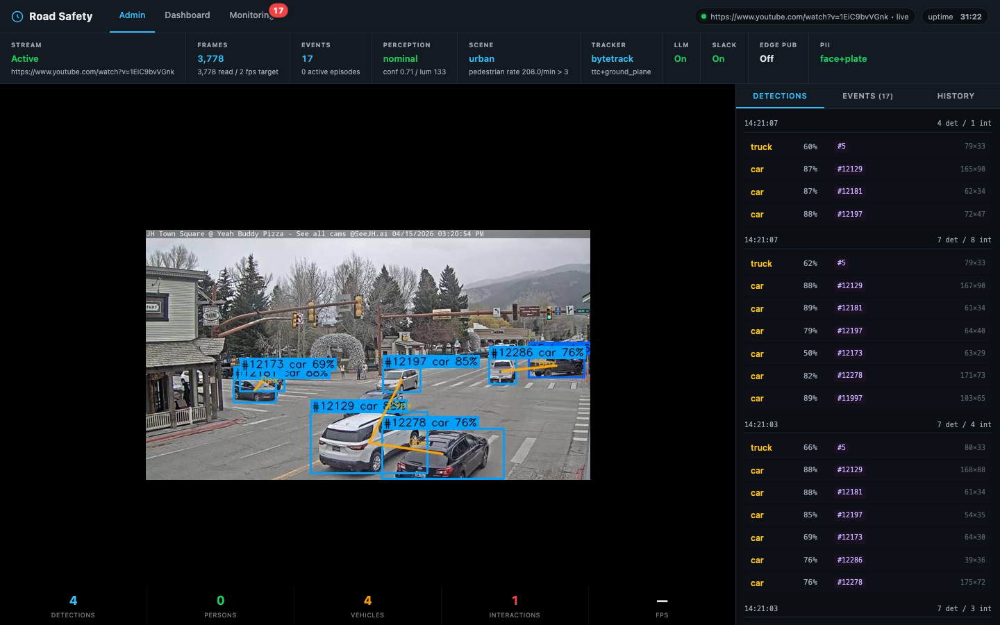
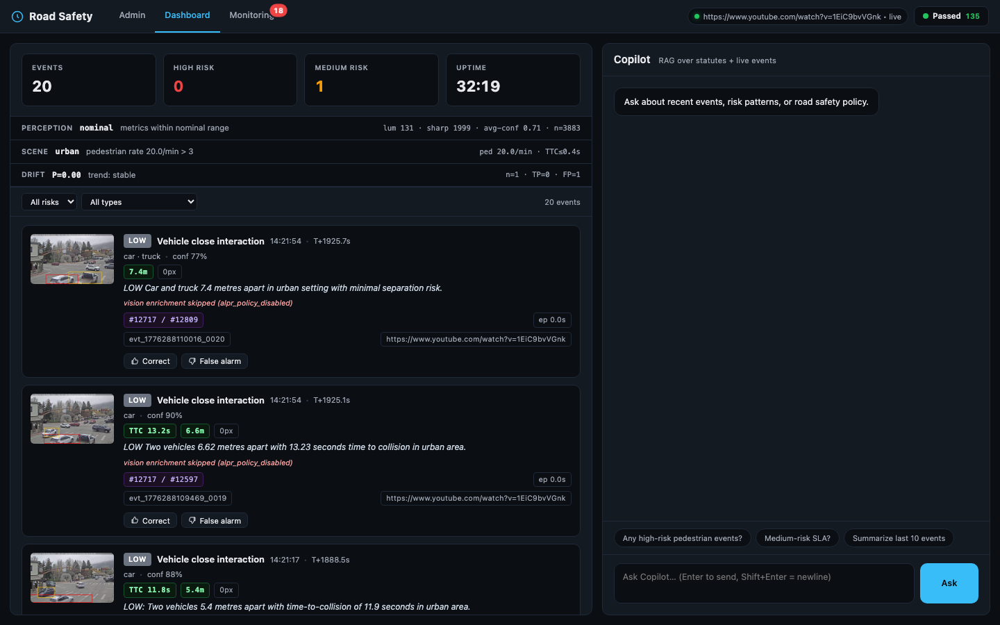
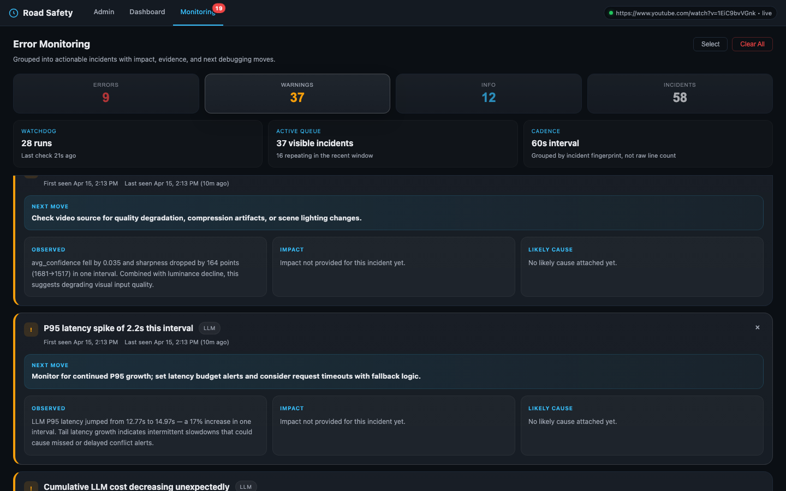
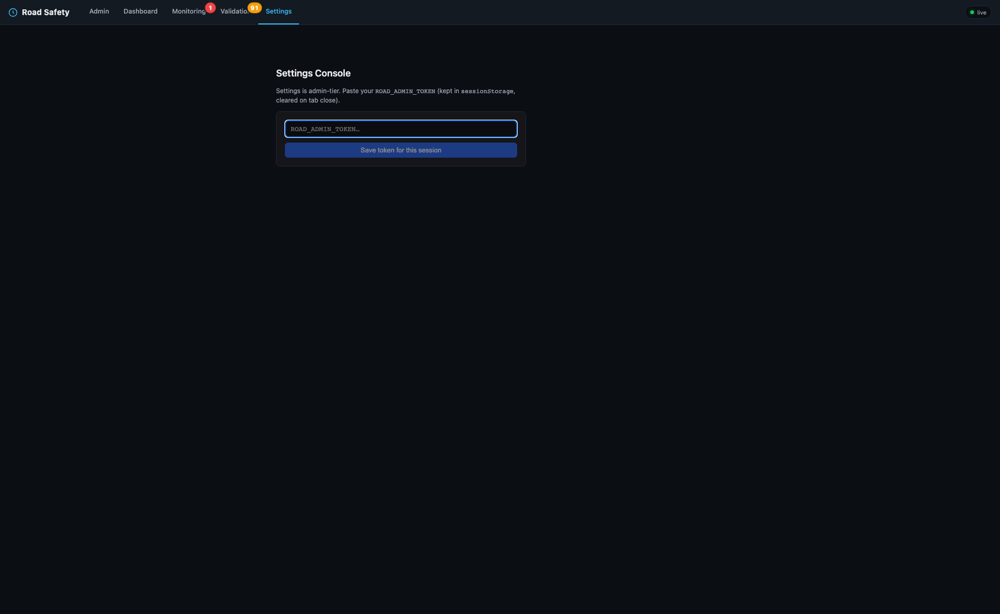
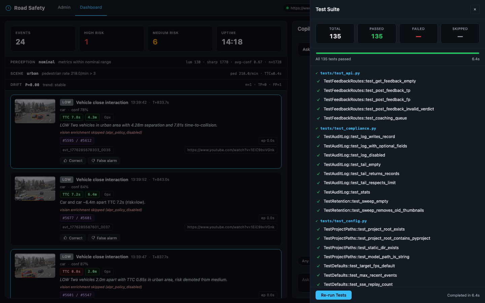

# Fleet Safety

Real-time conflict detection for **multi-camera in-vehicle fleet dashcams**. Each vehicle runs its own edge node over N on-board cameras (front, rear, left, right — as many as the vehicle is wired for) and analyzes every feed in parallel: YOLO tracking, multi-gate TTC, depth-aware proximity, and scene-adaptive thresholds. Risk is scored, PII is redacted on-device, and only typed events + redacted thumbnails leave the vehicle.

There are **no road-side, intersection, or infrastructure cameras** anywhere in the design. Everything is bolted to the car.

Built for the hard parts of production: running N cameras simultaneously on modest edge hardware, suppressing false positives without missing real incidents, surviving LLM outages gracefully, staying GDPR/CCPA-compliant by default, and catching model drift before it goes silent.

This is a **building block** for fleet safety platforms, not a complete commercial product. DMS (driver-facing camera), clip export, telematics fusion, and ELD are deliberately out of scope — see [Out of scope](#out-of-scope-deliberately) for what's missing and how to extend.

---

## Demo

The clip below shows the **multi-source admin grid** running a three-camera Nissan Rogue setup (front, rear, left) on demo footage. Each tile is an independent perception pipeline: the same detection stack runs N times in parallel, one per installed camera, with per-slot calibration so a 0.5× ultra-wide rear lens doesn't read distances the way a 1× front lens does. Operators can pause detection per tile (without killing the feed), watch the tile they care about in focus mode, and see live FPS / CPU impact as thresholds are tuned in the Settings console — all without restarting the server.


---

## Main Features

- **Multi-camera perception per vehicle** — one `StreamSlot` per installed camera (front / rear / left / right / …), each with its own YOLO+ByteTrack pipeline, calibration, and per-slot detection toggle. Admin grid renders them side by side; Settings tunes them live.
- **Per-slot camera calibration** — focal length, mount height, horizon fraction, orientation (`forward` / `rear` / `side`), and bumper offset are per-slot env vars. Side cameras skip the ground-plane prior (it degenerates on lateral views) and report distances as lateral range.
- **Layered false-positive gating** — 7 independent gates (multi-gate TTC, ego-motion, depth-aware proximity, scene-adaptive thresholds, sustained-risk episodes, perception quality, operator feedback) — a real conflict satisfies all, noise fails at the first.
- **Edge-first architecture** — all perception runs on-device. Only typed JSON events (~2 KB) and redacted thumbnails (~8 KB) cross the wire. A 1,000-vehicle fleet would push ~30 MB/day per vehicle instead of ~28 GB.
- **Privacy by default** — dual thumbnails (internal unredacted + public blurred), structural plate hashing **at the LLM ingest boundary** (not egress), DSAR-gated access, optional signed public-thumbnail tokens, and automated retention sweeps.
- **Resilient LLM layer** — Anthropic ↔ Azure failover, token-bucket rate budget, circuit breaker (3 failures → 60 s open), self-consistency ALPR, per-call cost/latency observability. Detection runs with zero LLM calls — LLM is enrichment, not critical path.
- **Settings console with warm reload** — `TARGET_FPS` and other knobs reload without bouncing the server; each apply produces a before/after FPS + CPU diff and is rollback-able.
- **Shadow-mode validator** — heavy precision/recall validator runs in shadow, surfaces drift to Admin / Dashboard / Settings / a dedicated Validation page, never blocks the hot path.
- **Video ↔ GPS playback sync** — running dashcam file becomes the map clock source; the VehicleMap replays the real GPX track alongside the video.
- **Drift monitoring with coverage guard** — rolling precision sliced by risk/type **plus** a `feedback_coverage` metric so biased-sample precision doesn't masquerade as health; active-learning sampling near the decision boundary.
- **Fleet-ready identity** — every event carries `vehicle_id` / `road_id` / `driver_id`; driver safety-score model with decay; road-wide aggregation endpoints.
- **Incident-queue watchdog** — findings grouped into fingerprinted incidents with impact, likely cause, owner, evidence, investigation steps, and ready-to-run debug commands. Not a wall of red text.
- **Operator-assist agents** — coaching, investigation, and reporting agents with bounded tool sets (≤5), hard iteration stops, audit-logged invocations.
- **Full audit trail** — every sensitive access logged with actor, resource, outcome, and IP — GDPR Art. 30 / SOC 2 ready.

---

## Screenshots












---

## Monitoring philosophy

The watchdog is an **incident queue**, not a wall of red text. Repeated findings are grouped into fingerprinted incidents, and each incident carries operator impact, likely cause, ownership hint, evidence, investigation steps, and fast debug commands. The goal is to shorten the path from "something looks wrong" to "I know exactly what to inspect next."

---

## Challenges & how we address them

### 1. Running N cameras per vehicle without melting the edge box

A single dashcam at 1080p / 30 fps already pins a laptop CPU. A modern fleet vehicle has 2–6 cameras (front, rear, left, right, sometimes interior + side-blind-spot). Naïvely running N YOLO pipelines in parallel, plus streaming each feed to the admin UI, will saturate CPU, network, and the browser's 6-connections-per-host limit long before the vehicle is off the lot.

**Our approach: one pipeline per physical camera, but every layer of the stack is aware that N > 1.**

| Layer | What it does |
|---|---|
| **Per-camera `StreamSlot`** | `ROAD_STREAM_SOURCES` is a comma-separated list of `id\|name\|url` entries; each entry spawns one `StreamSlot` with its own reader, detector, tracker, history, and context classifier. `/api/live/sources` exposes per-slot state. |
| **Per-slot detection toggle** | `POST /api/live/sources/{id}/detection` pauses inference on a tile without killing the live feed. Operators drop CPU on quiet tiles while keeping the video visible. |
| **Per-slot calibration** | `ROAD_CAMERA_{FOCAL_PX,HEIGHT_M,HORIZON_FRAC,ORIENTATION,BUMPER_OFFSET_M}__<SLOT>` overrides per camera. Side cams skip the ground-plane prior and report lateral range; rear cams flip orientation; ultra-wide lenses get their own focal length. |
| **YOLO auto-accelerator** | `load_model()` picks CUDA → MPS → CPU automatically. The same code runs on a Jetson, a Mac mini, and a Linux laptop. |
| **Encode-only-when-watched** | Each slot counts active MJPEG subscribers + recent polls. Idle tiles stop burning JPEG encode cycles; CPU scales with **viewers**, not with installed cameras. |
| **Transport split by protocol** | HTTPS tiles use MJPEG (one push connection per tile); HTTP tiles poll `/admin/frame/{id}` at ~400 ms. Works around the browser's 6-concurrent-connections-per-host cap in local dev, where MJPEG+SSE would deadlock past ~4 tiles. |
| **Auto-shedding + MJPEG decoder cap** | Backend shed policy plus frontend decoder cap keep the browser from melting at ≥6 tiles. |
| **Shadow validator, not inline** | Heavy precision checks run in a shadow worker. Drift surfaces in the UI; the hot path is untouched. |

### 2. False positives & alert fatigue

Fleet safety managers spend 30–60 minutes a day sorting false alerts from genuine incidents. When a system cries wolf, drivers and managers stop trusting it — and the safety value drops to zero. This is consistently the #1 operational complaint across the video-telematics industry.

**Our approach: layered gating where a real conflict satisfies every layer and noise fails at the first.**

| Layer | What it does |
|---|---|
| **Multi-gate TTC** | Time-to-collision fires only after 5 independent gates: ≥4-sample window spanning ≥1.5 s, monotonic bbox growth, jitter-floor pixel delta, non-trivial track motion, scale ratio above noise floor. Pair-TTC adds monotonic distance decrease + minimum closing rate. Based on FHWA's SSAM conflict methodology. |
| **Ego-motion gating** | TTC is discarded when neither track shows approach residual against optical-flow ego-motion. Bbox jitter on stationary objects cannot fire alarms. |
| **Depth-aware proximity** | Vehicle interactions gate on monocular 3D depth difference, not image-plane overlap. Distant cars whose bboxes overlap due to perspective are not flagged. |
| **Scene-adaptive thresholds** | Urban / highway / parking classifier rescales TTC and distance bands dynamically. Highway widens for reaction time; parking tightens for close quarters. |
| **Sustained-risk episodes** | Track-pair interactions accumulate into episodes. Peak risk is downgraded if not sustained ≥2 frames / ≥1.0 s. |
| **Perception-quality gating** | When a camera is degraded (low light, blur, occlusion), thresholds tighten conservatively and low-confidence events are suppressed. |
| **Operator feedback loop** | Operators mark events tp/fp. Drift monitor tracks rolling precision and alerts on degradation. Disputed events feed active learning. |

**If you change a gate, re-run `tests/test_core.py` before shipping** — each gate kills a specific class of false positive.

### 3. Edge / cloud bandwidth

A single 1080p dashcam streaming continuously for 8 hours generates ~28 GB/day. A 1,000-vehicle fleet would push 28 TB daily over cellular — economically impossible. Even event-triggered recording is 1–2 GB/day per camera. And real-time safety demands sub-second latency, so cloud round-trips aren't an option for the decision itself.

**Our approach: all perception runs on-device. Only typed JSON (~2 KB) + redacted thumbnails (~8 KB) cross the wire.**

| Layer | What it does |
|---|---|
| **Edge-first architecture** | Detection, tracking, risk classification, and PII redaction run on-device. Cloud receives structured events only. |
| **Lightweight model** | YOLOv8n (nano) — smallest YOLO variant, runs at 2 fps on a laptop CPU. On dedicated edge hardware (Jetson Orin NX) it exceeds 100 fps with TensorRT. |
| **HMAC-signed batched delivery** | Events queue locally in append-only JSONL. Batches of up to 20 are signed and POSTed together. Survives network outages with exponential backoff. |
| **Selective LLM enrichment** | Vision enrichment is policy-gated (`ROAD_ALPR_MODE=third_party`) and additionally skipped when perception is degraded or events are low-risk. No wasted API calls. |

### 4. LLM reliability in production

Rate limits degrade service, vision models hallucinate on ambiguous inputs (especially OCR), costs scale linearly with event volume, and a single-provider outage takes down the enrichment layer.

**Our approach: the LLM is enrichment, not critical path. Detection runs with zero LLM calls. Narration adds value when available and degrades silently when not.**

| Layer | What it does |
|---|---|
| **Multi-provider failover** | Anthropic ↔ Azure OpenAI automatic fallback on errors. |
| **Client-side rate budget** | Token-bucket limiter refuses calls *before* triggering 429s. Cheaper and faster than handling rate-limit failures. |
| **Circuit breaker** | After 3 consecutive failures the breaker opens for 60 s, halving API load during storms. |
| **Self-consistency ALPR** | Two independent vision calls at different temperatures. If plate readings disagree, output is null rather than hallucinated. |
| **Cost observability** | Every call instrumented: tokens, latency, USD cost, success/failure. Exposed via `/api/llm/stats`. |

### 5. Privacy & regulatory compliance (GDPR / CCPA)

In-vehicle cameras capture faces, license plates, and location — all classified as personal data. GDPR enforcement has exceeded €5.8 B in cumulative fines since 2018. License plates are treated as personal data by the UK ICO and EU DPAs because they link to identifiable owners.

**Our approach: minimize PII egress by default; enforce the invariant at ingest, not at egress.**

| Layer | What it does |
|---|---|
| **Dual thumbnails** | Every event produces an internal (unredacted, local-only) and a public (faces + plates blurred) version. Shared channels use only the public version; external enrichment is a separately governed processor path. |
| **Plate-hashing at LLM ingest boundary** | `enrich_event()` hashes the plate and strips `plate_text`/`plate_state` **before** the returned dict reaches any in-memory buffer. `server.py` keeps an egress `pop()` as defence in depth — but the primary invariant is that the raw plate was never in the buffer to begin with. |
| **Signed public-thumbnail tokens (optional)** | With `ROAD_PUBLIC_THUMBS_REQUIRE_TOKEN=1`, `_public` thumbnails require valid HMAC-signed short-lived `exp`/`token` params; all access is audit-logged. |
| **DSAR-gated access** | Unredacted thumbnails require an `X-DSAR-Token` header. Denied attempts are audit-logged. |
| **Audit trail** | Timestamp, actor, action, resource, outcome, IP. GDPR Art. 30 / SOC 2 ready. |
| **Automated retention** | Hourly sweeps delete data past configurable windows: thumbnails 30 d, feedback 90 d, active-learning 60 d. GDPR Art. 5(1)(e). |

*Jurisdictional note:* calibrated for EU/GDPR and CCPA. A driver-facing camera (DMS) extension would fall under **BIPA** in Illinois and require a consent-capture module before production.

### 6. Model drift & continuous improvement

>70 % of ML-deploying orgs report substantial drift within 6 months of production. Weather, new routes, seasonal lighting — all cause distribution shift. Without monitoring, precision silently degrades.

**Our approach: the feedback loop is a first-class feature, *and* it reports its own coverage so a biased-sample precision doesn't masquerade as health.**

| Layer | What it does |
|---|---|
| **Rolling precision** | Joins operator feedback with emitted events. Sliced by risk level and event type. |
| **Feedback-coverage metric** | `feedback_coverage` = labeled / total in window. Surfaced next to precision because operators label the alerts that bothered them, not a uniform sample. Precision-with-coverage is a stronger signal than precision alone. |
| **Trend detection** | Current window vs. prior non-overlapping window. Reports improving / stable / degrading. |
| **Active learning** | Events near the decision boundary (confidence 0.35–0.50) are sampled for relabeling. Disputed (fp-marked) events always captured. |
| **Label tool export** | Pending samples bundle into a zip with manifest JSON, ready for Label Studio / CVAT import. |
| **Shadow validator** | A heavier validator runs in shadow and surfaces a drift badge across Admin / Dashboard / Settings, plus a dedicated Validation page. |

### 7. Scaling to multi-vehicle fleets

The video telematics market reached ~6.1 M active units in North America in 2024, projected to ~13.8 M by 2029. Retrofitting vehicle identity, road-wide aggregation, and driver scoring after deployment is costly.

**Our approach: single-vehicle and multi-vehicle deployments use the same data model. Adding vehicles is a config change, not a code change.**

| Layer | What it does |
|---|---|
| **Vehicle / road / driver identity** | Every event carries `vehicle_id`, `road_id`, `driver_id`. Attributable from creation. |
| **Driver scoring** | Decaying penalty model: high-risk events deduct from max 100. Scores recover on a configurable schedule (`ROAD_SCORE_DECAY_INTERVAL_SEC`). |
| **Road-wide aggregation** | `/api/road/summary` and `/api/road/drivers` for fleet-level roll-ups. |
| **Edge / cloud split** | Each vehicle runs its own edge node. Events flow to a central cloud receiver over HMAC-signed HTTPS with `event_id` deduplication. |

### 8. Operator-assist agents (forward-looking capability)

Agent orchestration is **not** among the top operational complaints fleet safety managers raise today — that list is dominated by alert fatigue, coaching workflow, and claim evidence. Agents here are a forward-looking capability for operators drowning in events who need "what happened, why, what should the driver do differently?" as a structured answer.

**Our approach: single-responsibility agents with bounded tool sets. No agent has more than 5 tools. Agents recommend — operators decide.**

| Layer | What it does |
|---|---|
| **Coaching agent** | Retrieves event + road policy, generates a structured coaching note with specific driver action items. |
| **Investigation agent** | Correlates an event with similar events, feedback, and drift data. Produces a root-cause hypothesis with confidence. |
| **Report agent** | Queries event counts, feedback, and drift across a session. Produces a structured safety summary. |
| **Hard stops** | Max 5 iteration steps. Returns with what it has rather than looping. |
| **Observability** | Agent LLM calls share the same cost/latency tracking. Invocations are audit-logged. |

---

## Out of scope (deliberately)

A complete commercial fleet-safety product does more than this. Calling that out explicitly is more useful than implying coverage.

| Area | Why fleets care | Extension path |
|---|---|---|
| **In-cab Driver Monitoring (DMS)** — drowsiness, distraction, phone, seatbelt | Biggest crash-prevention lever in vendor marketing; ~80 % distracted-driving reductions attributed to DMS | Add a driver-facing camera slot + face/gaze landmarks + phone-object overlap + **Driver Privacy Mode** (BIPA consent) |
| **Insurance / FNOL** — MP4 clip evidence, carrier transport | Claim-handling cost drives most fleet camera purchases | Clip render exists; still needed: rolling pre/post-roll MP4 buffer, carrier endpoint adapters |
| **Telematics fusion** — GPS, IMU, CAN-bus, harsh-brake | Most commercial signals come from IMU + GPS, not vision. Ego-speed here is an optical-flow *proxy* | Ingest NMEA + accelerometer via USB GPS / OBD-II; set `speed_source="gps"` on events |
| **ELD / DVIR / HOS** | FMCSA-mandated for trucking | Adapters for Motive / Samsara / Geotab ELD APIs |
| **In-cab coaching UX + consent lifecycle** | Real coaching is in-cab / on-phone, not a web dashboard | In-cab app, enrollment flow, off-duty mute |
| **Multi-tenant RBAC** | Operators, safety managers, DPOs, drivers need different data rights | JWT + per-tenant rate limits; today we have DSAR + admin tokens |
| **Calibration UI** | Per-slot calibration is still env-driven | A console for tuning per-camera focal / height / orientation / offset without a restart |

---

## Summary

| Challenge | Industry reality | Our approach |
|---|---|---|
| **N cameras per vehicle** | 2–6 on-board cameras is normal; naïve scaling melts the edge box | Per-slot `StreamSlot` + per-slot calibration + per-slot detection toggle + encode-only-when-watched + HTTPS/HTTP transport split |
| False positives | #1 operational complaint | 7-layer gating: TTC gates, ego-motion, depth, scene-adaptive, episodes, perception quality, feedback |
| Edge/cloud bandwidth | Real cellular cost constraint at fleet scale | Edge-first; only event metadata + redacted thumbnails cross the wire |
| LLM reliability | Emerging — few production dashcams run LLMs today | Multi-provider failover, circuit breaker, self-consistency, rate budget, plate hashing at LLM boundary |
| Privacy compliance | EU: mature enforcement. US: active BIPA litigation on biometric capture | Dual thumbnails, plate hashing at ingest, DSAR gating, audit trail, auto-retention, signed thumbnail tokens |
| Model drift | Real but under-monitored | Rolling precision + feedback-coverage guard, trend detection, active learning, shadow validator |
| Fleet scaling | Must support per-vehicle identity from day one | Vehicle/road/driver identity baked in, driver scoring, road-wide aggregation |
| Operator-assist agents | Forward-looking | Bounded tools (≤5), structured JSON, hard stops, observability |
| DMS, FNOL transport, telematics fusion, ELD, calibration UI | Dominant commercial value in real products | **Out of scope** — extension paths listed above |

---

## Quick start

```bash
git clone <repo-url> && cd fleet-safety
python3 -m venv .venv && source .venv/bin/activate
pip install -e ".[dev]"
cp .env.example .env
python start.py
```

Or with Docker: `docker compose up --build`

Set `ROAD_ADMIN_TOKEN` to access protected endpoints (`/api/audit`, `/api/llm/*`, `/api/road/*`, `/api/agents/*`, `/api/settings/*`, `/admin/video_feed/*`).

### Running N cameras

```ini
# .env — three cameras on one Nissan Rogue
ROAD_STREAM_SOURCES=primary|Front Cam|resourses/Front Cam.mp4,rear|Rear Cam|resourses/Rear Cam.mp4,left|Left Cam|resourses/Left Cam.mp4

# Per-slot calibration (front 1× wide, rear + left 0.5× ultra-wide)
ROAD_CAMERA_FOCAL_PX__PRIMARY=600
ROAD_CAMERA_HEIGHT_M__PRIMARY=1.25
ROAD_CAMERA_BUMPER_OFFSET_M__PRIMARY=1.7
ROAD_CAMERA_ORIENTATION__PRIMARY=forward

ROAD_CAMERA_FOCAL_PX__REAR=260
ROAD_CAMERA_HEIGHT_M__REAR=1.10
ROAD_CAMERA_BUMPER_OFFSET_M__REAR=0.3
ROAD_CAMERA_ORIENTATION__REAR=rear

ROAD_CAMERA_FOCAL_PX__LEFT=260
ROAD_CAMERA_HEIGHT_M__LEFT=1.00
ROAD_CAMERA_BUMPER_OFFSET_M__LEFT=0.1
ROAD_CAMERA_ORIENTATION__LEFT=side
```

The admin grid at `/` renders one live tile per slot.

---

## Configuration

All runtime settings are environment-driven via `.env`. Key groups:

| Group | Vars | Notes |
|---|---|---|
| **Multi-camera sources** | `ROAD_STREAM_SOURCES` | Comma-separated `id\|name\|url` entries. Each entry spawns its own `StreamSlot` with independent detection. |
| **Camera calibration (global)** | `ROAD_CAMERA_FOCAL_PX`, `ROAD_CAMERA_HEIGHT_M`, `ROAD_CAMERA_HORIZON_FRAC` | Fallback for single-camera installs. **Calibrate per-install** for real deployments — wrong values bias every distance / speed signal. |
| **Per-slot calibration** | `ROAD_CAMERA_FOCAL_PX__<SLOT>`, `ROAD_CAMERA_HEIGHT_M__<SLOT>`, `ROAD_CAMERA_HORIZON_FRAC__<SLOT>`, `ROAD_CAMERA_ORIENTATION__<SLOT>` (`forward`/`rear`/`side`), `ROAD_CAMERA_BUMPER_OFFSET_M__<SLOT>` | Multi-camera vehicles set these per slot (e.g. `__PRIMARY`, `__REAR`, `__LEFT`). Side cams skip the ground-plane prior and report lateral range. |
| **Vehicle identity** | `ROAD_VEHICLE_ID`, `ROAD_ID`, `ROAD_DRIVER_ID`, `ROAD_LOCATION` | Required for fleet-scale deployments; every event is attributed to a specific vehicle + driver. |
| **Privacy + access** | `ROAD_DSAR_TOKEN`, `ROAD_ADMIN_TOKEN`, `ROAD_PLATE_SALT`, `ROAD_PUBLIC_THUMBS_REQUIRE_TOKEN`, `ROAD_THUMB_SIGNING_SECRET` | DSAR token gates unredacted-thumbnail access. Optional signed-token mode can gate `_public` thumbnails too. Salt / signing secrets should be per deployment. |
| **LLM** | `ANTHROPIC_API_KEY`, optional `AZURE_OPENAI_*`, `ROAD_ALPR_MODE` | Fully optional. System runs end-to-end with zero LLM calls — narration, ALPR, and agents degrade silently. External ALPR is off by default. |
| **Runtime tuning** | `ROAD_TARGET_FPS`, `ROAD_SCORE_DECAY_INTERVAL_SEC` | `TARGET_FPS` warm-reloads via the Settings console (no restart). Score decay loop off with `0`. |
| **Cloud delivery** | `ROAD_CLOUD_ENDPOINT`, `ROAD_CLOUD_HMAC_SECRET` | Edge → cloud HMAC-signed batched delivery. Without these, events stay local. |

See `.env.example` for the full list.

### Production deployment caveat

Any deployment with **≥6 cameras per vehicle** must front uvicorn with an HTTP/2 reverse proxy (nginx, Caddy, Cloudflare, ALB). HTTP/2 multiplexes all streams over one TCP connection, dissolving the browser's 6-connections-per-host cap. TLS termination at the proxy automatically flips the frontend into MJPEG mode — no client config needed. Both transports stay live regardless, so `/admin/frame/{id}` is available for one-shot snapshots and tests.

---

## Testing

```bash
make test    # or: pytest tests/ -v
```

Covers the multi-gate conflict-detection pipeline, per-slot stream management, services, API routes, compliance, auth guards, and integrations.

## License

MIT — see [LICENSE](LICENSE).
