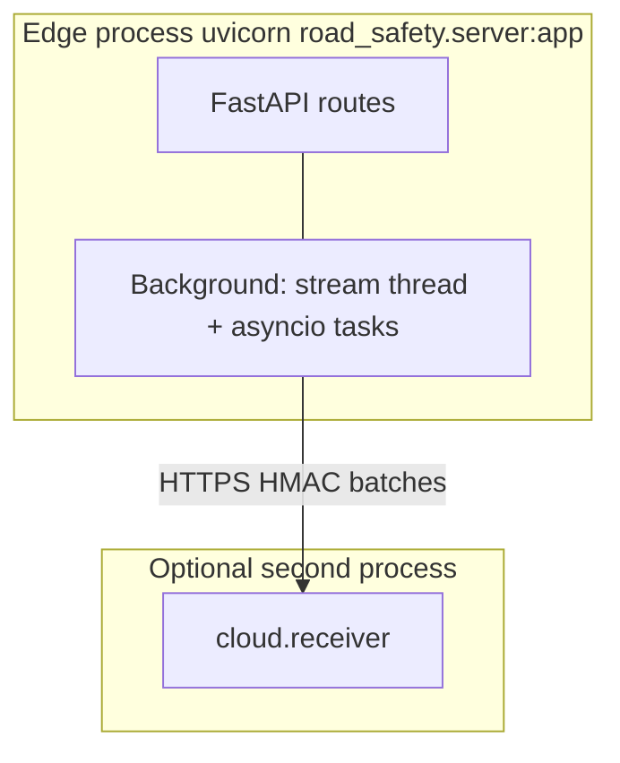
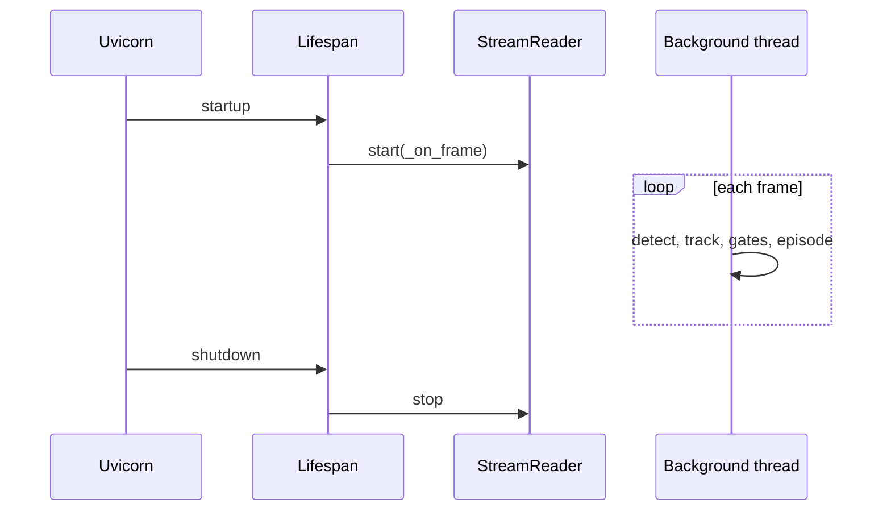
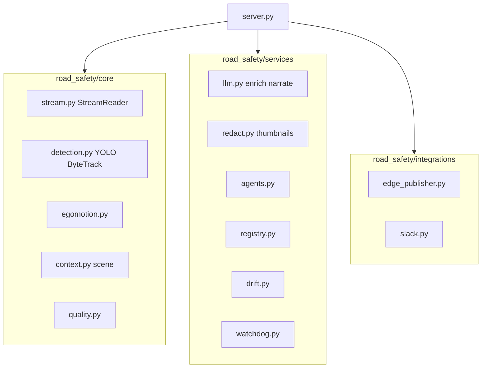

# Backend infrastructure

This document describes the **Python** side of the fleet safety demo: processes, packages, the perception pipeline, background tasks, and HTTP surface. It assumes **little or no Python background** — file roles and execution flow are explained in plain language.

---

## 1. Big picture: one main process (+ optional cloud)

| Process | Module | Typical port | Role |
|---------|--------|--------------|------|
| **Edge / main app** | `road_safety.server:app` | 8000 | FastAPI: REST + SSE + static UI; runs vision loop in a background thread. |
| **Cloud receiver** (optional) | `cloud.receiver:app` | 8001 | Separate FastAPI app: ingests **HMAC-signed** batches from the edge; stores in SQLite. |

They are **different programs** on purpose (different trust boundary and scaling). See `docs/architecture.md` for the edge/cloud diagram; this file focuses on the **edge** server.

---

## 2. How Python runs the server

1. **Uvicorn** is an ASGI server: it runs the FastAPI `app` object and handles HTTP/WebSockets/SSE.
2. **`lifespan`** (in `road_safety/server.py`) runs **once at startup** and **once at shutdown**:
   - Loads the YOLO model.
   - Resolves the video source (HLS, file, webcam, RTSP).
   - Starts `StreamReader` with a callback for each frame.
   - Starts asyncio tasks: digest schedulers, optional edge publisher loop, retention loop, optional score decay, optional watchdog loop.
   - Wires `AgentExecutor` for coaching/investigation/report agents.
   - Starts the background test runner.

3. **Per-frame work** runs in a **worker thread** inside `StreamReader` (not one HTTP request per frame). Results are pushed into in-memory state and to SSE subscribers.

---

## 3. Configuration: single source of truth

**`road_safety/config.py`** defines:

- **Paths** — `PROJECT_ROOT`, `DATA_DIR`, `THUMBS_DIR`, `STATIC_DIR` (prefers `frontend/dist`, else `static/`).
- **Env-driven settings** — model path, FPS, tokens, fleet IDs, camera calibration, ports, watchdog, etc.

**Rule (from project conventions):** other modules import from `config.py` instead of building paths with `Path(__file__)`.

---

## 4. Package layout (`road_safety/`)

| Area | Responsibility |
|------|----------------|
| **`server.py`** | FastAPI app, global `state`, routes, lifespan, perception loop glue, SSE broadcast. |
| **`config.py`** | Paths and environment variables. |
| **`logging.py`** | Logging setup. |
| **`security.py`** | Shared `require_bearer_token` for admin/cloud read endpoints. |
| **`core/`** | **Perception pipeline:** stream input, YOLO + ByteTrack, egomotion, scene context, quality, interaction/TTC math. |
| **`services/`** | **Non-CV services:** LLM + observability, redaction, agents, registry (fleet scores), drift, digest, watchdog, test runner, etc. |
| **`integrations/`** | **Outbound integrations:** Slack, FNOL, `EdgePublisher` (cloud). |
| **`compliance/`** | Audit log append, retention sweeps. |
| **`api/feedback.py`** | Feedback POST/GET and coaching queue; mounted into the main app. |

---

## 5. The hot path: frame → event (conceptual)

Each frame goes through **stacked gates** (see `CLAUDE.md` for the full ordered list). In short:

1. **StreamReader** — decodes frames at `TARGET_FPS` (default 2 fps).
2. **`detect_frame`** — YOLO + tracking; `TrackHistory` for motion history.
3. **Ego / scene / quality** — ego motion estimate, scene label (urban/highway/…), camera quality gate.
4. **`find_interactions` + TTC / distance** — pairwise vehicle interactions, time-to-collision style risk.
5. **`Episode`** — aggregates risk over time; **sustained-risk** rules reduce single-frame noise.
6. **`_emit_event`** — builds JSON event, **redacts** thumbnails, optional LLM narration, broadcasts to SSE, Slack, optional cloud queue.

**LLM is optional:** detection and events work without any LLM configured.

---

## 6. Global `state` (in `server.py`)

The app keeps a **mutable state object** (not shown in full here) holding things like:

- Loaded **model**, **StreamReader**, **source label**.
- **`recent_events`** — in-memory deque/list of event dicts (bounded by `MAX_RECENT_EVENTS`).
- **Subscribers** — asyncio queues for SSE (`/stream/events`, `/admin/detections`).
- **Episodes** — open interaction episodes.
- **Drift**, **active learner**, **edge publisher**, **watchdog**, **agent executor**, **quality** monitor, **scene** classifier references.

HTTP handlers read this state; the frame loop updates it.

---

## 7. HTTP API surface (grouped)

Routes are registered on the single FastAPI app in `server.py` (plus `mount_feedback_routes`).

### Static and shell

- `GET /` — `index.html` from `STATIC_DIR`.
- `GET /favicon.ico`
- Static mounts: `/assets` or `/static` depending on Vite build layout.

### Live streams

- `GET /stream/events` — **SSE**: replay last `SSE_REPLAY_COUNT` events, then live queue; keepalives.
- `GET /admin/video_feed` — **MJPEG** multipart stream of annotated JPEGs.
- `GET /admin/detections` — **SSE** of JSON detection snapshots for admin UI.

### JSON APIs (public / operational)

- `GET /api/live/status`, `/api/live/perception`, `/api/live/scene`
- `GET /api/live/events`, `GET /api/events`, `GET /api/events/{event_id}`
- `GET /api/drift`
- `GET /api/summary` — loads batch artifact `data/summary.json` (from offline analysis pipeline).
- `GET /api/admin/health`
- `GET /api/watchdog`, `GET /api/watchdog/recent`, delete endpoints for findings
- `GET /api/tests/status`, `POST /api/tests/run`
- `POST /chat` — RAG-style copilot over recent events + corpus
- Feedback: `POST /api/feedback` (and related routes from `api/feedback.py`)

### Admin-token gated (`Authorization: Bearer` + `ROAD_ADMIN_TOKEN`)

Examples: `/api/llm/*`, `/api/audit*`, `/api/retention/sweep`, `/api/active_learning/export`, `/api/road/*`, `/api/agents/*`.

### Thumbnails

- `GET /thumbnails/{name}` — public `*_public.*` with optional signed query params; internal names need `X-DSAR-Token` when `ROAD_DSAR_TOKEN` is set.

---

## 8. Background asyncio tasks (lifespan)

| Task | Purpose |
|------|---------|
| **Digest schedulers** | Periodic digest emails/notifications (`services/digest.py`). |
| **Edge publisher loop** | If `ROAD_CLOUD_ENDPOINT` + `ROAD_CLOUD_HMAC_SECRET` set: flush queued events to cloud. |
| **Retention loop** | Hourly data retention policy (`compliance/retention.py`). |
| **Score decay** | Optional periodic decay of driver safety scores (`ROAD_SCORE_DECAY_INTERVAL_SEC`). |
| **Watchdog loop** | Periodic snapshots → LLM/rules-based incident findings (`services/watchdog.py`). |

---

## 9. Data on disk (`data/`)

Typical artifacts (exact names depend on features used):

- `thumbnails/` — redacted and internal JPEGs.
- JSONL logs: audit, watchdog, feedback, outbound queue, etc.
- `corpus/` — policy/statute text for copilot RAG.
- Optional: `events.json`, `summary.json` from batch tools.

**Cloud DB** (separate process): `data/cloud.db` SQLite on the receiver.

---

## 10. Python dependencies (`pyproject.toml`)

Core runtime includes:

- **ultralytics** — YOLOv8.
- **opencv-python** — image I/O and drawing.
- **lapx** — association for tracking.
- **fastapi**, **uvicorn** — web stack.
- **httpx** — outbound HTTP (cloud, APIs).
- **anthropic** — LLM client (with project code paths for other providers in services).
- **python-dotenv** — `.env` loading.

Dev: **pytest** and plugins for tests in `tests/`.

---

## 11. Launcher and Docker

- **`start.py`** — builds frontend, optionally runs pytest, starts uvicorn, waits for `/api/live/status`, opens browser.
- **`docker-compose.yml`** — `app` service on port 8000; optional `cloud-receiver` profile on 8001.

---

## 12. Privacy and security (backend-centric)

- **Plate text** must not live in buffers: enforced at enrichment (`services/llm.py` / redaction path); see `CLAUDE.md`.
- **Audit** — `compliance/audit.py` logs sensitive actions.
- **Three access tiers** — public SSE/dashboard vs `X-DSAR-Token` vs `Bearer` admin (detailed in integration doc).

---

*Next: [integration-infrastructure.md](./integration-infrastructure.md) for how the browser maps to these endpoints and how the edge talks to the cloud.*
