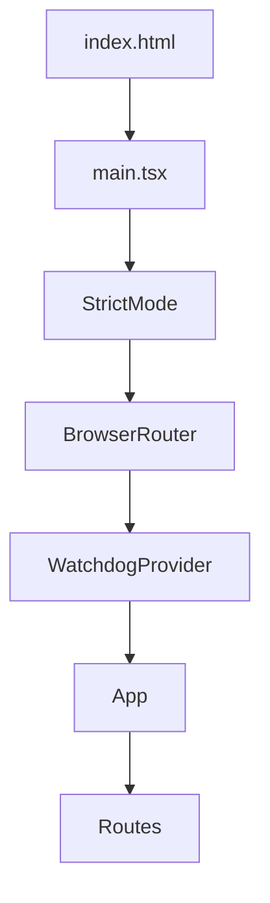
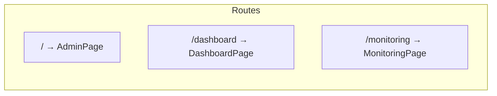
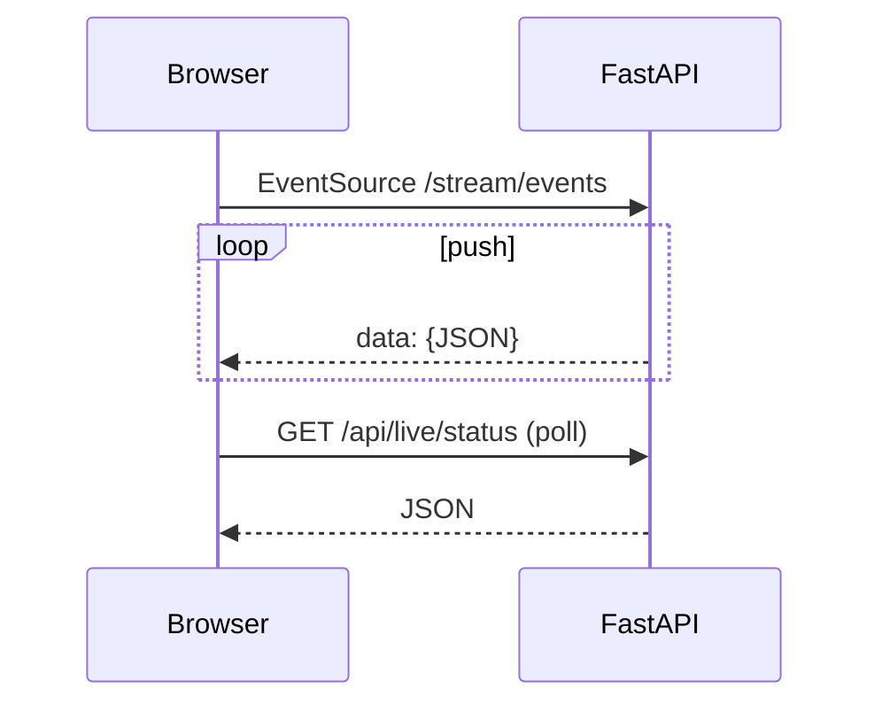
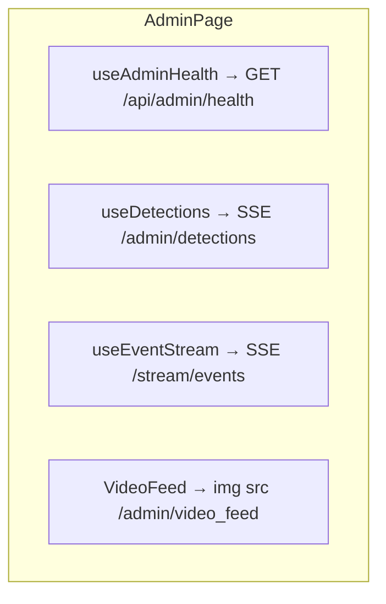
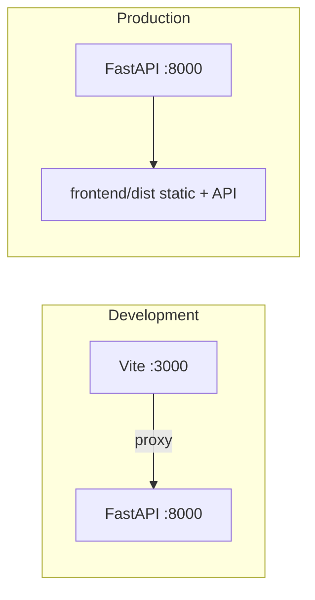

# Frontend infrastructure

This document describes the **React** single-page application (SPA) in `frontend/`: how it is built, how pages are wired, and how the browser talks to the backend. It is written for readers with **limited React experience** — concepts are explained briefly where they matter.

---

## 1. What the frontend is responsible for

The UI does **not** run computer vision. It:

- Renders three main screens (routes).
- Opens **Server-Sent Events (SSE)** connections for **live** updates (events, detection snapshots).
- Calls **REST JSON** endpoints for status, history, watchdog, tests, and feedback.
- Displays images from `/thumbnails/...` and a live MJPEG preview from `/admin/video_feed`.

All “brains” (YOLO, tracking, LLM, Slack, cloud publish) run in Python on the server.

---

## 2. Technology stack

| Piece | Role |
|--------|------|
| **React 19** | UI library: components re-render when state changes. |
| **TypeScript** | Types for props and API payloads (`src/types.ts`). |
| **Vite** | Dev server + production bundler: outputs static files to `frontend/dist/`. |
| **react-router-dom** | URL-based navigation (`/`, `/dashboard`, `/monitoring`). |

Dependencies are minimal on purpose: no Redux, no UI kit — only React and the router.

---

## 3. How the app boots (entry → tree)



| File | Purpose |
|------|---------|
| `index.html` | Root HTML shell; contains `<div id="root">`. |
| `main.tsx` | Creates the React root, wraps the app in `BrowserRouter` and `WatchdogProvider`, imports global CSS. |
| `App.tsx` | Declares routes: which URL shows which page component. |
| `styles/global.css` | Global styles (variables, layout primitives). |

**React terms (minimal):**

- **Component** — a function that returns JSX (HTML-like markup).
- **Hook** — functions like `useState`, `useEffect`, custom hooks in `hooks/` that encapsulate data loading or subscriptions.
- **Provider** — a wrapper that holds shared state for children (here, watchdog polling context).

---

## 4. Routing (URLs → pages)

Defined in `frontend/src/App.tsx`:

| Path | Page component | Primary purpose |
|------|----------------|-----------------|
| `/` | `AdminPage` | Live video strip, detection sidebar, event list, history tab. |
| `/admin` | Redirect → `/` | Legacy alias. |
| `/dashboard` | `DashboardPage` | Fleet-style overview: SSE events, tiles, copilot chat, drift, tests. |
| `/monitoring` | `MonitoringPage` | Watchdog incident queue UI. |
| `*` | Redirect → `/` | Unknown paths go home. |



---

## 5. Folder structure (mental model)

```
frontend/src/
├── main.tsx, App.tsx          # Entry + routes
├── types.ts                   # Shared TypeScript shapes (events, health, etc.)
├── styles/global.css
├── lib/
│   ├── api.ts                 # fetch() wrappers for REST JSON
│   └── format.ts              # Human-readable formatting helpers
├── hooks/                     # Reusable data/subscription logic
├── components/                # Presentational + composite UI
│   ├── admin/                 # Admin page: video, detections, health, history
│   ├── dashboard/             # Dashboard tiles, copilot, banners
│   ├── events/                # Event cards, feedback buttons
│   ├── layout/                # TopBar, etc.
│   ├── tests/                 # Test runner badge + drawer
│   ├── watchdog/              # Badges/drawers used with watchdog
│   └── ui/                    # Small primitives (Pill, Tag, RiskBadge, …)
└── pages/                     # Route-level screens (*.module.css per page)
```

**Convention:** Pages **compose** hooks + components. Hooks **hide** whether data comes from SSE or HTTP.

---

## 6. Two ways the UI gets data

### 6.1 REST (`fetch`)

Centralized in `lib/api.ts`: typed helpers that call `fetch` with `cache: "no-store"` and parse JSON.

Examples: `/api/live/status`, `/api/live/scene`, `/api/drift`, `/api/admin/health`, `/api/watchdog`, `/api/feedback`, `/chat`, `/api/tests/run`.

### 6.2 Server-Sent Events (SSE)

Implemented in `hooks/useSSE.ts` using the browser **`EventSource`** API:

- Connects to a URL (e.g. `/stream/events`).
- Parses each message’s `data` field as JSON.
- On error, closes and **reconnects** with exponential backoff.

**Two separate SSE streams:**

| Hook | URL | Payload |
|------|-----|---------|
| `useEventStream` | `/stream/events` | Safety events + occasional `PerceptionState` (`_meta: "perception_state"`). |
| `useDetections` | `/admin/detections` | Per-frame detection snapshots for the admin sidebar. |



---

## 7. Page-by-page data flow

### Admin (`/` — `AdminPage.tsx`)



- **Health strip** — structured snapshot (server, pipeline, integrations, perception, scene, ego).
- **Video** — MJPEG stream (not SSE): `` style consumption in `VideoFeed`.
- **Detections tab** — rolling buffer of last N snapshots from SSE.
- **Events tab** — live events from main SSE stream.
- **History** — `HistoryPanel` uses `useHistory` → `api.getLiveEvents` → `GET /api/live/events`.

### Dashboard (`/dashboard` — `DashboardPage.tsx`)

- `useEventStream` — same live events + perception as admin.
- `useLiveStatus` — `GET /api/live/status`.
- `useScene` — `GET /api/live/scene`.
- `useDrift` — `GET /api/drift`.
- `useTests` — `GET /api/tests/status`, `POST /api/tests/run`.
- `useChat` / `CopilotPanel` — `POST /chat` with JSON body `{ query }`.

### Monitoring (`/monitoring` — `MonitoringPage.tsx`)

- `useLiveStatus`, `useEventStream` for context.
- Watchdog data via `WatchdogContext` (provider in `main.tsx`) + `useWatchdog` / `api` for `/api/watchdog` and `/api/watchdog/recent`, delete endpoints.

---

## 8. Development vs production (important)

### Development (`npm run dev`)

- Vite serves the app (default port **3000** in `vite.config.ts`).
- **`server.proxy`** forwards API-like paths to `http://localhost:8000`, so the browser still uses **relative** URLs like `/api/...` and they hit the Python server.

Proxied prefixes include: `/api`, `/stream`, `/chat`, `/thumbnails`, `/admin/video_feed`, `/admin/detections`.

### Production (`npm run build` + Python)

- Vite emits static assets into **`frontend/dist/`**.
- The FastAPI app sets `STATIC_DIR` to that folder when it exists (`road_safety/config.py`).
- Uvicorn serves **one origin**: HTML, JS, `/api/*`, SSE, thumbnails — **no CORS puzzle** for same host/port.



---

## 9. Build pipeline

`package.json` scripts:

- `npm run build` → `tsc -b && vite build` (TypeScript check, then bundle to `dist/`).
- `python start.py` at repo root runs `npm run build` before starting uvicorn (see root `start.py`).

---

## 10. What is intentionally *not* in the frontend

- No direct WebSocket usage (SSE is enough for server→client push).
- No client-side routing to backend microservices — only paths the FastAPI app exposes.
- No embedding of secrets: admin-only APIs require `Authorization: Bearer ...` on the server; the stock UI does not attach those headers (those endpoints are for operators/tools).

---

## 11. Quick reference — hooks → transport

| Hook | Transport | Endpoint(s) |
|------|-----------|----------------|
| `useSSE` | SSE | Generic |
| `useEventStream` | SSE | `/stream/events` |
| `useDetections` | SSE | `/admin/detections` |
| `useLiveStatus` | GET | `/api/live/status` |
| `useScene` | GET | `/api/live/scene` |
| `useDrift` | GET | `/api/drift` |
| `useAdminHealth` | GET | `/api/admin/health` |
| `useTests` | GET + POST | `/api/tests/status`, `/api/tests/run` |
| `useHistory` | GET | `/api/live/events` |
| `useChat` | POST | `/chat` |
| `useWatchdog` / context | GET + DELETE/POST | `/api/watchdog*` |

---

*See also: [integration-infrastructure.md](./integration-infrastructure.md) for the full FE↔BE contract and auth tiers.*
