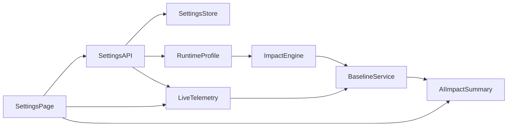

# Backend Settings Console Plan

## Goal
Create a new top-level `Settings` tab in `TopBar` (alongside **Admin**, **Dashboard**, and **Monitoring**) that combines:
- the live video stream
- editable backend tuning parameters
- baseline vs current impact telemetry
- AI-assisted interpretation of changes
- saved settings templates with add/edit/delete/apply

## Critical Review Findings (Addressed In This Revision)
- **Comparability risk**: baseline vs current was underspecified and could be invalid when traffic mix, scene label, or camera quality changes between windows.
- **Apply safety gap**: no atomic apply contract (partial updates, mid-frame mutation, or invalid mixed state risk).
- **Template governance gap**: no revision history or immutable versioning for reproducibility and rollback.
- **Contract ambiguity**: settings endpoints were listed, but no explicit read/write auth tier split or compatibility policy.
- **Testing gap**: no concrete acceptance criteria for hot-reload, restart-required behavior, failure handling, or regression protection.

## Additional Critical Review (Round 2 — Gaps, Inconsistencies, Improvements)

### Navigation and copy vs. current app
- **"Next to Monitoring"** is correct for *placement* (add a fourth `<Link>` in `TopBar`), but the live MJPEG feed today lives on the **`/` (Admin)** page, not on Monitoring. Monitoring is the watchdog incident queue. The Settings page will *reuse* `VideoFeed` like Admin; call that out in UX copy so operators are not confused about two "live" pages (`/` vs `/settings`).
- **`/admin` is a legacy redirect** to `/` (`App.tsx`). New work should use **`/settings`** (or another explicit path), not resurrect `/admin` as the primary settings URL.
- **`TopBar.tsx` file header** claims it is rendered above `<Routes>` in `App.tsx`; in the current codebase each page imports `TopBar` itself. When implementing Settings, follow the existing per-page pattern unless you introduce a shared layout route.

### Frontend auth is an explicit greenfield
- `frontend/src/lib/api.ts` intentionally documents that **Bearer / DSAR routes are not exposed** in the public `api` object. A Settings UI that calls `/api/settings/*` must introduce a **separate, audited path**: e.g. `Authorization: Bearer` from a dev-only env (`VITE_*`), operator paste flow, or a tiny `adminFetch` helper. Document token handling (no logging, no accidental inclusion in error reports) and 401/403 UX.
- **SSE limitation**: `EventSource` cannot set headers. If any settings or impact stream uses SSE with auth, mirror existing patterns (query token only if server supports it, or use `fetch` streaming) — do not assume Bearer on `EventSource` without backend support.

### Read vs write auth (tighten the contract)
- "All settings **writes** admin-only" leaves **GET** ambiguous. For a tuning console, **recommend admin Bearer for all `/api/settings/*` reads** (effective config, templates, revisions, baseline, impact). That avoids leaking thresholds and fleet-tuning intent to unauthenticated clients on the same origin. If anything stays public-tier, list it explicitly (likely *nothing* under `/api/settings/`).
- Align wording with `CLAUDE.md`: today **`/api/admin/health`** is used from the public `api` helper for the health strip — that is separate from the new settings surface.

### Audit "who" vs shared token
- The backend uses a **single shared** `ROAD_ADMIN_TOKEN`. Audit entries can record token fingerprint, IP, user-agent, or an optional **`X-Operator-Label`** (free text) on mutations — but not true multi-user identity without a stronger auth system. Replace "who" in UX/docs with **"mutation id + timestamp + optional operator label"** where identity is weak.

### Impact API shape
- **`GET /api/settings/impact`** is not a pure resource fetch if it depends on selected baseline id, time window, or live cursor. Prefer **`GET ...?baseline_id=…&window=…`** with documented cache semantics, or **`POST /api/settings/impact/compute`** with a body — avoid a "GET" that mutates server comparison state unexpectedly.

### Phase ordering vs inventory
- **Phase 0** asks to finalize schema before **Phase 1** inventories knobs — that can deadlock. Either **move a minimal knob inventory into Phase 0** (enough to name fields and reload classes) or rename Phase 0 to "skeleton + validation only" and accept that schema v1 may churn once inventory completes.

### Deployment and scope boundaries
- **Single edge process**: file-backed storage under `data/` assumes one writer. Call out **multi-instance / HA** as out of scope unless you add a shared store and leader election or externalize settings to a fleet control plane.
- **Cloud receiver (`cloud/receiver.py`)** remains separate; settings apply to the **edge** process only — document that cloud DB templates are not auto-synced unless explicitly built later.

### Observability and ops
- Add **metrics or structured logs** for apply success/failure, rollback, validation errors, and comparability-blocked comparisons — not only audit files — so operators can alert on failed applies.

### Definition of Done additions
- **Retention** for template/baseline history is listed under Production Practices; add a concrete cap (count or age) to **Definition of Done** or it may slip.
- **Settings UI works with the repo’s admin auth story** (token available to the SPA in dev/prod-appropriate ways) — without this, backend endpoints are useless.

### Non-goals (clarity)
- **Fleet-wide template distribution** across many vehicles, **A/B routing** of live traffic, and **automatic** promotion of templates are out of scope for v1 unless explicitly added later.

## Critical Review (Round 3 — Verified Against Code)

This pass cross-checks the plan against the actual repo and against the Codex v1.1 and Claude Code v1.1 plans. Items below are real gaps to close before implementation, with the fix folded into the relevant section.

### Factual / consistency fixes
- **SSE route name**: the existing live SSE handler is **`/stream/events`** in `road_safety/server.py` (around line 1724), not `/api/live/stream`. Any new settings-impact stream should mirror that handler's pattern (heartbeat, queue cleanup), not a non-existent path.
- **TopBar mounting**: the `TopBar.tsx` *file header* claims it is rendered above `<Routes>` in `App.tsx`, but `App.tsx` does **not** render it — each page imports `TopBar` itself. Plan already notes this; we keep the per-page pattern. Updating the stale TopBar header comment is a **prereq cleanup**, not a Settings deliverable.
- **Live MJPEG path**: `/admin/video_feed` is intentionally **public** in `server.py` (`admin_video_feed`) so the SPA can render it without auth. Reusing `VideoFeed` on Settings inherits that posture — call this out so reviewers do not assume the video stream is gated by Bearer.

### S0 prerequisite hardening (must precede launch)
The Settings console expands the admin surface and operator foot traffic. Lock down already-known soft spots first:
- **Public watchdog mutators are public** today: `DELETE /api/watchdog/findings` and `POST /api/watchdog/findings/delete` in `server.py` are documented as `AUTH: public`. Either move them behind `require_bearer_token` (recommended) or explicitly accept the risk in writing — but do not stack a new admin console on top of unaudited public destructive endpoints.
- **`recent_events` concurrency**: `state.recent_events.append()` in `_run_loop` (line ~1310) and `pop(0)` are read by many endpoints (and will be read by the new impact engine) without a lock. Add a small lock or move to a thread-safe deque before the impact engine starts sampling, or define explicit "best-effort, may miss" semantics for impact reads.
- **Publish an explicit auth matrix** in the same PR (public read, admin write, DSAR), so the new `/api/settings/*` defaults to fail-closed and existing exceptions are documented.

### Hot-reload bucket needs a fourth class
"Hot-reloadable / restart-required / read-only" is too coarse. Add a **`warm_reload`** class for settings that hot-apply but require a subsystem rebuild on the apply thread:
- `TRACK_HISTORY_LEN` — must rebuild every per-track `deque(maxlen=...)`, not just rebind a constant.
- `LLM_BUCKET_CAPACITY` / `LLM_BUCKET_REFILL_*` — must rebuild the shared `_HAIKU_BUCKET` instance.
- Tracker config / model variant — full restart only when path changes; some params (e.g. NMS thresholds) can warm-reload by re-instantiating the tracker.

Without this class, "hot-reload" silently sometimes-needs-a-rebuild and the apply path becomes unprincipled.

### Cross-field validators are mandatory, not optional
Range checks alone allow operators to break safety invariants. The schema must enforce, server-side, at minimum:
- `TTC_MED_SEC > TTC_HIGH_SEC`
- `DIST_MED_M > DIST_HIGH_M`
- `MIN_SCALE_GROWTH > 1.0`
- `LLM_BUCKET_CAPACITY >= 1`
- `SLACK_HIGH_MIN_CONFIDENCE >= CONF_THRESHOLD`

Validation errors must return 422 with a structured `[{key, reason}]` body so the UI can highlight individual rows.

### Subscriber callback isolation
The atomic-apply story breaks if a subscriber raises mid-apply (e.g. LLM bucket rebuild fails). Spec must require:
- Per-subscriber `try/except` with structured warning back to the apply caller.
- Subscribers run **after** snapshot swap, so a subscriber failure does not leave the snapshot in a partially-applied state.
- Failed subscribers are surfaced in the `ApplyResult` (e.g. `warnings: [{subscriber, error}]`) and audit-logged.

### Scene-context coupling — surface "effective" thresholds
`SceneContextClassifier.adaptive_thresholds()` rescales `TTC_*` / `DIST_*` at runtime by scene (urban/highway/parking). If an operator changes raw `TTC_HIGH_SEC` and the scene mix shifts, the *effective* threshold differs from what they set. Required UX: each tunable row shows **`raw → effective`** when scene multipliers apply, plus a tooltip showing the active scene multiplier. Comparability checks already cover scene drift between baseline and post-window; this is the per-knob, in-the-moment companion.

### Apply-time template re-validation and migration
A saved template applied after a spec change can violate new validators or reference dropped keys. Required behavior on `POST /api/settings/templates/{id}/apply`:
- Re-validate the template payload against the **current** schema before snapshot swap.
- Run a registered **migration map** (`schema_v_n → schema_v_n+1`) for known field renames/removals; reject with 409 + diff if migration is undefined.
- Audit-log `settings.template.migrated` when migration ran.

### SSE auth — pick one solution
The plan correctly notes `EventSource` cannot set headers but stops there. Recommended v1 answer: **short-lived ticket exchange**:
1. `POST /api/settings/stream_ticket` (Bearer-required) → returns one-time, short-TTL (≤60 s) opaque ticket.
2. `GET /api/settings/impact/stream?ticket=...` validates and consumes the ticket, then upgrades to SSE.
3. Tickets are single-use, in-memory, never logged in plaintext.

Avoids the leak vectors of long-lived `?token=` (access logs, browser history, `Referer`). Fallback for older clients: `fetch`-based NDJSON streaming with `Authorization` header.

### Persistence — pick one storage
"JSON files or SQLite" is unresolved. Pick **SQLite** at `data/settings.db` for v1:
- Multi-row queries (revisions, baselines, history) are first-class.
- Single-writer file-locking is well-defined under the edge process model.
- Schema migrations are explicit (one tiny `migrations/` table).
- Avoids the JSON tempfile-rename pattern leaking partial writes on crash.

Templates remain individually exportable as JSON via `GET .../templates/{id}` for ops portability.

### Impact session must survive process restart
With in-memory-only impact state, a server restart between apply and observation loses the after-window — operators cannot judge the change they just made. Required:
- Persist `ImpactSession` (audit_id, change_ts, before/after snapshots, baseline window, last narrative) to SQLite on every tick.
- On boot, if a non-archived session exists with `change_ts` within the last `IMPACT_SESSION_MAX_AGE_SEC`, resume it.
- Append archived sessions to `data/settings_history.jsonl` (or a `history` table) for `GET /api/settings/impact/history`.

### Multi-tab / lost-update protection
Two operators (or two tabs) can race PUT/PATCH on settings or templates. Required:
- Every `EffectiveSettings` and `Template` response carries a `revision_hash` (or ETag).
- `POST /api/settings/apply` and `PATCH /api/settings/templates/{id}` accept `If-Match: <hash>` and return **409 Conflict** with the current state if it does not match.
- UI surfaces "your view is stale, refresh to see the newer revision" instead of silently overwriting.

### Privacy mode (`ROAD_ALPR_MODE`) needs special-casing
Toggling ALPR changes the data-handling posture. Required:
- The mutation must require `?confirm_privacy_change=1` (or an extra body field) so it cannot ride a generic bulk apply.
- Distinct audit row `settings.privacy_change` for **both** off→on **and** on→off transitions.
- UI shows a confirmation dialog explaining what changes (logging, audit retention, downstream sharing).

### Apply-rate debounce
Without a server-side cooldown, a misbehaving UI loop or a stuck slider can thrash the snapshot many times per second, polluting audit and triggering many baseline captures. Required:
- `MIN_CHANGE_INTERVAL_SEC = 5` (or similar) per-token cooldown on `POST /api/settings/apply`. Returns 429 with `Retry-After`.
- Frontend debounces slider drags into one PUT after ~400 ms quiescence.

### Bootstrap UX in dev
`require_bearer_token` fails closed (503) when `ROAD_ADMIN_TOKEN` is unset. The Settings page in a freshly cloned repo will be unusable without docs. Add to the runbook:
- A `.env.example` line with a generated dev token.
- A clear "no token configured" empty state in the UI (read-only view of effective settings + a doc link), instead of repeated 503 toasts.

### Comparability algorithm — make it concrete
"Comparability confidence" is currently hand-wavy. Spec one algorithm in v1:
- **Sample size**: require `>= MIN_BASELINE_EVENTS` (default 20) and `>= MIN_AFTER_EVENTS` (default 20). Below threshold → `confidence="low"` with reason `"insufficient_events"`.
- **Scene-mix similarity**: Jensen–Shannon divergence between baseline and after scene-label histograms; if `JSD > 0.2` → `confidence` capped at `medium`, reason `"scene_mix_drift"`.
- **Quality similarity**: same-bucket fraction of `QualityMonitor.state()` between windows; if `< 0.6` → cap `confidence="low"`, reason `"quality_drift"`.
- **Window length**: each window `>= 300 s` clock time, expanding to 600/1200/1800 if sample-size threshold not met.

### Retention defaults (concrete numbers)
The DoD says "documented retention cap" but never picks one. Default v1 caps:
- **Templates**: unlimited count, soft-delete kept 90 days.
- **Template revisions**: keep last 100 per template **or** 365 days, whichever is larger.
- **Baseline snapshots**: keep last 200 **or** 90 days.
- **Impact sessions**: keep last 500 **or** 90 days.
- **Audit log**: governed by existing retention policy (no change).

These are knobs themselves and should appear in `SETTINGS_SPEC` as `read_only` informational entries surfaced in the UI.

### Restart-required UX must be defined
"Marked restart-required" is incomplete without an apply story:
- Operator clicks Apply → mutating fields are split into `applied_now` (hot/warm) and `pending_restart` (restart-required).
- UI shows a persistent "Restart required for: X, Y" banner with a `[Show diff]` link.
- The actual restart is **not** orchestrated by the Settings API in v1 (out of scope) — it is operator-initiated via the existing process supervisor / `docker compose restart`.
- On boot, the server reads pending restart-required values from storage and applies them as the initial snapshot.

### Audit identity — store fingerprint cautiously
"Audit entries can record token fingerprint" risks leaking the shared admin token. If we store anything derived from the token:
- Hash with HMAC-SHA256 keyed by a per-install secret (e.g. `ROAD_AUDIT_KEY`), not bare SHA256.
- Truncate to the first 8 chars in the audit row; never log the full hash.
- Prefer the optional `X-Operator-Label` and IP/UA only; treat fingerprint as a "best effort" tie-break.

### Frontend chart bundle hygiene
Whatever chart library is chosen (recharts/visx/lightweight SVG) must be **route-split** (`React.lazy(() => import("./pages/SettingsPage"))`) so non-Settings users on `/`, `/dashboard`, `/monitoring` do not pay the bundle cost.

### Observability (concrete signals)
Beyond "metrics or structured logs", commit to specific signals so an alert can be wired:
- Counters: `settings_apply_total{result=success|validation_error|subscriber_error|conflict}`.
- Gauge: `settings_revision` (current revision number, monotonically increasing).
- Counter: `settings_rollback_total`.
- Counter: `impact_comparability_blocked_total{reason}`.
- Histogram: apply latency (snapshot swap + subscriber fan-out).

## Definition of Done (Production Readiness)
- Operators can add/edit/delete/apply templates safely from a new Settings tab.
- Backend enforces schema/range **and cross-field** validation and atomic settings apply.
- Every apply can be dry-run validated before commit.
- Baseline-vs-current comparison includes a concrete comparability algorithm (sample-size, scene-mix JSD, quality similarity) and low-signal warnings.
- Rollback to last-known-good is one click and auditable.
- Existing detection gates remain intact; only configured thresholds change.
- Tests cover settings API, runtime propagation, rollback, **subscriber-failure isolation**, **template re-validation/migration**, **multi-tab If-Match conflicts**, **`recent_events` concurrency under impact reads**, and backward compatibility.
- Operators can configure **how the SPA supplies the admin Bearer token** for settings calls (dev/prod-appropriate), without exposing the token in client logs, access logs, browser history, `Referer`, or error telemetry. SSE uses the **ticket-exchange** flow.
- Template/baseline/impact history has **concrete retention caps** (defaults: 100 revisions/template or 365 d; 200 baselines or 90 d; 500 impact sessions or 90 d).
- **S0 prereq hardening done**: watchdog mutators are admin-gated (or explicitly accepted in writing), and `state.recent_events` access is concurrency-safe for the impact engine.
- **Persistence chosen**: SQLite at `data/settings.db` with a documented schema migration table.
- **Impact sessions survive process restart** (resumed if within `IMPACT_SESSION_MAX_AGE_SEC`).
- **Privacy mode flips** (`ROAD_ALPR_MODE`) require `confirm_privacy_change=1` and emit `settings.privacy_change` audit rows for both directions.
- **Apply-rate debounce**: `MIN_CHANGE_INTERVAL_SEC` server-side cooldown returns 429; UI debounces drag-PUTs to ~400 ms.
- **Restart-required UX defined**: split apply result into `applied_now` and `pending_restart`; persistent banner + diff; operator-initiated restart, not API-orchestrated.
- **Observability signals** (`settings_apply_total{result}`, `settings_revision`, `settings_rollback_total`, `impact_comparability_blocked_total{reason}`, apply-latency histogram) are emitted.
- Frontend chart library is **route-split** to `/settings`.

## Current System Constraints
- Top-level navigation links live in [`/Users/andreitekhtelev/Desktop/fleet-safety-demo/frontend/src/components/layout/TopBar.tsx`](/Users/andreitekhtelev/Desktop/fleet-safety-demo/frontend/src/components/layout/TopBar.tsx); routes are declared in [`/Users/andreitekhtelev/Desktop/fleet-safety-demo/frontend/src/App.tsx`](/Users/andreitekhtelev/Desktop/fleet-safety-demo/frontend/src/App.tsx). The live perception UI is at **`/`** (`AdminPage`); **`/admin` redirects to `/`**. Add e.g. **`/settings`** for this feature — do not overload the legacy `/admin` path.
- The existing `Monitoring` page is a watchdog incident queue, not a live tuning page: [`/Users/andreitekhtelev/Desktop/fleet-safety-demo/frontend/src/pages/MonitoringPage.tsx`](/Users/andreitekhtelev/Desktop/fleet-safety-demo/frontend/src/pages/MonitoringPage.tsx).
- The live MJPEG stream already exists at `/admin/video_feed` and is rendered by [`/Users/andreitekhtelev/Desktop/fleet-safety-demo/frontend/src/components/admin/VideoFeed.tsx`](/Users/andreitekhtelev/Desktop/fleet-safety-demo/frontend/src/components/admin/VideoFeed.tsx).
- Backend detection thresholds are currently split across hardcoded constants and env-backed config in [`/Users/andreitekhtelev/Desktop/fleet-safety-demo/road_safety/config.py`](/Users/andreitekhtelev/Desktop/fleet-safety-demo/road_safety/config.py), [`/Users/andreitekhtelev/Desktop/fleet-safety-demo/road_safety/core/detection.py`](/Users/andreitekhtelev/Desktop/fleet-safety-demo/road_safety/core/detection.py), [`/Users/andreitekhtelev/Desktop/fleet-safety-demo/road_safety/core/context.py`](/Users/andreitekhtelev/Desktop/fleet-safety-demo/road_safety/core/context.py), and [`/Users/andreitekhtelev/Desktop/fleet-safety-demo/road_safety/services/drift.py`](/Users/andreitekhtelev/Desktop/fleet-safety-demo/road_safety/services/drift.py).
- The backend already exposes useful live telemetry via `/api/live/status`, `/api/live/scene`, `/api/drift`, and `/api/admin/health` in [`/Users/andreitekhtelev/Desktop/fleet-safety-demo/road_safety/server.py`](/Users/andreitekhtelev/Desktop/fleet-safety-demo/road_safety/server.py), but it does not persist baselines, compare config versions, or support runtime templates.

## Contract and Consistency Decisions To Lock First
- Keep the existing live telemetry contracts (`/api/live/status`, `/api/live/scene`, `/api/drift`, `/api/admin/health`) as read sources for Settings (health/status remain usable from the existing public-tier polling pattern where applicable).
- Treat **all `/api/settings/*` routes as admin-tier** (Bearer on every call, reads and writes) unless a specific sub-resource is explicitly documented as public — default is **fail closed**.
- Add a strict settings schema version so frontend and backend can evolve safely.
- Keep settings data separate from environment secrets and deployment identity.
- Expose optional **`X-Operator-Label`** (or similar) on mutations so audit logs carry human context under a single shared admin token.

## Recommended Architecture

## Backend Design
### 1. Create a single runtime settings domain model
Add a dedicated settings module, for example under `road_safety/services/` or `road_safety/api/`, that defines:
- an `EffectiveSettings` schema for all operator-tunable parameters
- a `SettingsTemplate` schema for named reusable presets
- a `TemplateRevision` schema for immutable version history
- a `BaselineSnapshot` schema for frozen comparison windows
- an `ImpactReport` schema for current-vs-baseline metrics and AI summary output

This should become the single mutable layer for runtime tuning, while leaving secrets and deployment identity in [`/Users/andreitekhtelev/Desktop/fleet-safety-demo/road_safety/config.py`](/Users/andreitekhtelev/Desktop/fleet-safety-demo/road_safety/config.py).

### 2. Classify settings by safety and reloadability
Split parameters into **four** buckets (Round-3 update — `warm_reload` is a real bucket distinct from pure hot-apply).

**`hot_apply`** — pure snapshot rebind, picked up next frame:
- detection confidence and bbox floors (`CONF_THRESHOLD`, `PERSON_CONF_THRESHOLD`, `VEHICLE_PAIR_CONF_FLOOR`, `MIN_BBOX_AREA`)
- TTC and distance thresholds (`TTC_HIGH_SEC`, `TTC_MED_SEC`, `DIST_HIGH_M`, `DIST_MED_M`)
- episode/cooldown thresholds (`PAIR_COOLDOWN_SEC`, `MIN_SCALE_GROWTH`)
- scene-specific adaptive multipliers (operator sees both raw and effective values — see Round-3 "scene-context coupling")
- quality-monitor thresholds (`QUALITY_BLUR_SHARP`, `QUALITY_LOW_LIGHT_LUM`)
- drift alert thresholds and evaluation window size
- alerting thresholds for downstream notifications (`SLACK_HIGH_*`, `SLACK_MIN_RISK`)

**`warm_reload`** — hot but requires a subsystem rebuild on the apply thread (run inside an isolated subscriber callback):
- `TRACK_HISTORY_LEN` — must rebuild every per-track `deque(maxlen=...)`, not a constant swap.
- `LLM_BUCKET_CAPACITY` / `LLM_BUCKET_REFILL_*` / `LLM_CB_THRESHOLD` / `LLM_CB_COOLDOWN_SEC` — rebuild shared `_HAIKU_BUCKET` / circuit-breaker state.
- Tracker config (NMS thresholds, max-age) when the tracker exposes a hot re-init path.

**`restart_required`** — value persists, takes effect on next process start:
- model path / model variant
- source stream defaults if they affect process startup semantics
- `TARGET_FPS` (rebuilding the loop timer mid-tick is fragile in v1; revisit in v2)
- queue/buffer sizes that influence loop bring-up

**`read_only`** (surfaced in UI for visibility, never editable):
- admin tokens, DSAR token, HMAC secrets
- fleet identity (`ROAD_VEHICLE_ID`, `ROAD_ID`, `ROAD_DRIVER_ID`)
- retention/audit policy values
- security-critical configuration

This avoids mixing safe operator tuning with infrastructure and secret management, and prevents "hot-reload" from silently sometimes-needing-a-rebuild.

### 3. Centralize today’s fragmented thresholds
Refactor the hardcoded tunables now spread across:
- [`/Users/andreitekhtelev/Desktop/fleet-safety-demo/road_safety/core/detection.py`](/Users/andreitekhtelev/Desktop/fleet-safety-demo/road_safety/core/detection.py)
- [`/Users/andreitekhtelev/Desktop/fleet-safety-demo/road_safety/core/context.py`](/Users/andreitekhtelev/Desktop/fleet-safety-demo/road_safety/core/context.py)
- [`/Users/andreitekhtelev/Desktop/fleet-safety-demo/road_safety/server.py`](/Users/andreitekhtelev/Desktop/fleet-safety-demo/road_safety/server.py)
- [`/Users/andreitekhtelev/Desktop/fleet-safety-demo/road_safety/services/drift.py`](/Users/andreitekhtelev/Desktop/fleet-safety-demo/road_safety/services/drift.py)

Use injected runtime settings rather than module-level literals for the tunable subset. Keep the existing gate structure intact; only parameter values should change.

### 4. Add authenticated settings APIs with audit trail
Extend [`/Users/andreitekhtelev/Desktop/fleet-safety-demo/road_safety/server.py`](/Users/andreitekhtelev/Desktop/fleet-safety-demo/road_safety/server.py) (or, preferably, a new `road_safety/api/settings.py` mounted via `app.include_router(...)` to keep `server.py` from growing) with admin-tier endpoints such as:
- `POST /api/settings/validate` (dry-run validation + compatibility check)
- `GET /api/settings/schema` (current `SETTINGS_SPEC` for the UI to render rows)
- `GET /api/settings/effective` (current values + raw vs scene-effective + revision_hash)
- `GET /api/settings/templates`
- `POST /api/settings/templates`
- `PATCH /api/settings/templates/{id}` (accepts `If-Match`)
- `DELETE /api/settings/templates/{id}` (soft delete; `system=true` returns 409)
- `GET /api/settings/templates/{id}/revisions`
- `POST /api/settings/templates/{id}/apply` (re-validate + migrate + snapshot swap + capture baseline)
- `POST /api/settings/apply` (atomic apply; `If-Match` + `MIN_CHANGE_INTERVAL_SEC` debounce; `?confirm_privacy_change=1` required for `ROAD_ALPR_MODE` flips)
- `POST /api/settings/baseline/capture`
- `GET /api/settings/impact?audit_id=...&window=...` (deterministic compare; query-shaped, never mutates server state)
- `POST /api/settings/impact/compute` (operator-driven, body-shaped recompute)
- `GET /api/settings/impact/history?limit=...`
- `POST /api/settings/rollback` (or `POST /api/settings/revert_last`)
- `POST /api/settings/stream_ticket` (issues short-TTL one-time SSE ticket)
- `GET /api/settings/impact/stream?ticket=...` (SSE — modeled on the existing `/stream/events` handler in `server.py`)

Protect **all** settings routes with the existing bearer-token helper ([`/Users/andreitekhtelev/Desktop/fleet-safety-demo/road_safety/security.py`](/Users/andreitekhtelev/Desktop/fleet-safety-demo/road_safety/security.py)). The SSE stream is the single exception: it accepts the one-time **ticket** issued by `stream_ticket` (which itself requires Bearer). Audit every mutation through [`/Users/andreitekhtelev/Desktop/fleet-safety-demo/road_safety/compliance/audit.py`](/Users/andreitekhtelev/Desktop/fleet-safety-demo/road_safety/compliance/audit.py) and emit the observability counters listed in the Round-3 review (apply success/failure, rollback, comparability-blocked).

### 5. Persist settings templates and baseline snapshots
Store operator-managed artifacts in **SQLite at `data/settings.db`** (decision locked in Round-3 review), with a small `migrations` table for schema evolution. Tables (sketch):
- `templates(id, name, description, created_at, updated_at, system, soft_deleted_at)`
- `template_revisions(id, template_id, revision_no, payload_json, payload_hash, created_at, created_by_label)` — immutable
- `baselines(id, template_revision_id, settings_hash, captured_start, captured_end, sample_count, scene_mix_json, quality_mix_json, metrics_json)`
- `impact_sessions(id, audit_id, change_ts, before_json, after_json, baseline_id, last_narrative_json, state, archived_at)`
- `apply_log(id, ts, actor_label, revision_hash_before, revision_hash_after, result, warnings_json)`

Templates support add/edit/delete (soft delete) **and apply**, with **apply-time re-validation and migration**: a saved template is re-validated against the current schema and run through registered `schema_v_n → schema_v_n+1` migrations before snapshot swap; if no migration is registered, fail with 409 + diff.

Edits create new immutable revisions so every experiment can be reproduced. Templates remain individually exportable as JSON via `GET /api/settings/templates/{id}` for ops portability and bootstrap.

### 6. Enforce atomic apply and concurrency safety
- Apply settings as a single validated transaction, never piecemeal field updates.
- Use a settings snapshot object that the frame loop reads atomically (`MappingProxyType` view over a frozen dict, swapped under a short `RLock`).
- Reject partial invalid payloads with per-field errors (422 + `[{key, reason}]`).
- Enforce **cross-field validators** server-side (`TTC_MED > TTC_HIGH`, `DIST_MED > DIST_HIGH`, `MIN_SCALE_GROWTH > 1.0`, `LLM_BUCKET_CAPACITY >= 1`, `SLACK_HIGH_MIN_CONFIDENCE >= CONF_THRESHOLD`).
- Keep previous-good snapshot in memory and durable storage for immediate rollback.
- Define explicit failure behavior if apply fails mid-operation: old settings remain active; partially-failed subscribers are surfaced in `ApplyResult.warnings` and audit-logged.
- **Subscriber isolation**: each `on_change`/`register_subscriber_for` callback runs inside its own `try/except` after the snapshot swap. A subscriber raising never reverts the snapshot — it is reported back as a warning.
- **Concurrency for impact reads**: the impact engine samples `state.recent_events`; coordinate with the existing append/`pop(0)` path (small lock or thread-safe deque) — see Round-3 prereq hardening.
- **Lost-update protection**: every settings/template response carries a `revision_hash`; mutating endpoints accept `If-Match` and return 409 on mismatch.
- **Apply cooldown**: enforce `MIN_CHANGE_INTERVAL_SEC` per token; return 429 + `Retry-After` on bursts.

### 7. Build a real impact engine, not just raw before/after numbers
Use deterministic metrics as the primary comparison engine:
- event rate by severity and event type
- precision / false-positive trend from drift feedback
- confidence distributions
- interactions per minute
- perception-quality health values
- scene label mix
- frame processing throughput and backlog

Recommended first production version:
- capture a baseline window before a change using current effective settings
- after apply, compute rolling deltas over an equivalent post-change window
- expose absolute values, percentage change, confidence level, and low-data warnings
- include comparability guards: scene distribution drift, quality-state drift, and sample-size minimums

Recommended second-stage enhancement:
- add a shadow evaluator that re-scores live detections with a candidate settings profile without emitting alerts, so operators can preview likely impact before fully applying changes

### 8. Define baseline methodology explicitly
- Baseline snapshot stores:
  - settings hash and template revision id
  - capture start/end timestamps
  - sample counts and metric confidence
  - scene/quality mix signatures used for comparability checks
- Comparison endpoint returns:
  - raw deltas
  - normalized deltas
  - confidence score
  - machine-readable reasons when comparison quality is low

### 9. Make AI interpretation advisory, not authoritative
Implement the "AI analyzes impact on the fly" requirement as two layers:
- primary: deterministic comparison service that computes baseline vs current deltas
- secondary: optional LLM summary that explains likely causes, trade-offs, and confidence using the computed metrics

This fits the repo's existing "LLM is enrichment, not critical path" rule and avoids hallucinated operational decisions.

### 10. Add explicit API compatibility policy
- Add `settings_schema_version` to all settings payloads.
- Reject unknown required fields and warn on deprecated optional fields.
- Keep one-version backward compatibility to support staggered frontend/backend deploys.

### 11. Testing and reliability gates
- Unit tests for schema validation, range guards, and template revisioning.
- Integration tests for apply/rollback atomicity and no-gate-regression behavior.
- API tests for auth enforcement, audit writes, and contract shapes.
- End-to-end smoke test: capture baseline -> apply template -> observe impact -> rollback.
- Fault injection tests: invalid payload, storage write failure, drift endpoint unavailable.

## Frontend Design
### 1. Add a new top-level Settings page
Update:
- [`/Users/andreitekhtelev/Desktop/fleet-safety-demo/frontend/src/App.tsx`](/Users/andreitekhtelev/Desktop/fleet-safety-demo/frontend/src/App.tsx)
- [`/Users/andreitekhtelev/Desktop/fleet-safety-demo/frontend/src/components/layout/TopBar.tsx`](/Users/andreitekhtelev/Desktop/fleet-safety-demo/frontend/src/components/layout/TopBar.tsx)

Add a new [`/Users/andreitekhtelev/Desktop/fleet-safety-demo/frontend/src/pages/SettingsPage.tsx`](/Users/andreitekhtelev/Desktop/fleet-safety-demo/frontend/src/pages/SettingsPage.tsx) route (e.g. `/settings`) registered in `App.tsx` alongside `/`, `/dashboard`, and `/monitoring`.

### 2. Compose the Settings page around live decision-making
Recommended page sections:
- live video panel reusing the current MJPEG feed
- current effective settings panel
- editable grouped controls by category
- baseline capture/apply/rollback controls
- template library with add/edit/delete/apply
- impact summary cards
- charts for baseline vs current values
- AI explanation panel with confidence/warnings
- restart-required indicator for settings that cannot hot-reload
- apply safety controls: validate, apply, rollback, and revert to last-known-good

### 3. Extend the frontend contract cleanly
Update:
- [`/Users/andreitekhtelev/Desktop/fleet-safety-demo/frontend/src/types.ts`](/Users/andreitekhtelev/Desktop/fleet-safety-demo/frontend/src/types.ts)
- polling hooks under [`/Users/andreitekhtelev/Desktop/fleet-safety-demo/frontend/src/hooks`](/Users/andreitekhtelev/Desktop/fleet-safety-demo/frontend/src/hooks)

Add a **dedicated authenticated fetch layer** for settings (new module, e.g. `lib/settingsApi.ts` or `lib/adminFetch.ts`). Do **not** silently fold Bearer routes into the existing public `api` object in [`/Users/andreitekhtelev/Desktop/fleet-safety-demo/frontend/src/lib/api.ts`](/Users/andreitekhtelev/Desktop/fleet-safety-demo/frontend/src/lib/api.ts) without an explicit security review — that file documents that admin routes are intentionally omitted.

Optionally re-export thin wrappers from `api.ts` only if they clearly require an injected token or a single blessed init path.

Add typed contracts for:
- settings schema
- template list
- apply/rollback result
- baseline snapshot
- impact report
- chart series
- AI comparison summary

### 4. Add comparison visualizations
The frontend currently has no chart library, so plan for one lightweight chart dependency or small SVG-based charts.

Initial charts should focus on operational signal, not dashboard decoration:
- baseline vs current event-rate bars
- precision / false-positive delta trend
- confidence histogram or percentile trend
- processing FPS / latency trend
- scene mix or severity distribution comparison

### 5. UX safeguards for operator confidence
- Show "comparison confidence" and "insufficient data" states prominently.
- Require confirmation before destructive template delete.
- Disable apply while validation fails or server reports incompatibility.
- Surface audit metadata for each settings change (timestamp, revision id, optional operator label; "who" is weak under a single shared admin token).

## Production Practices
- Keep secrets and deployment-only config out of the editable settings UI.
- Validate all numeric ranges server-side with safe min/max bounds.
- Show "restart required" explicitly for non-hot-reload settings.
- Preserve a last-known-good template and one-click rollback.
- Audit every apply, rollback, and template mutation.
- Add low-sample warnings so operators do not overreact to noisy short windows.
- Prefer deterministic math for comparison, with AI explanations layered on top.
- Do not bypass existing detection gates; tune parameters inside the current safety model.
- Version template changes immutably for reproducibility and rollback.
- Enforce atomic settings snapshots to avoid mid-frame partial state.
- Add retention policy for baseline/template history to prevent unbounded growth.

## Delivery Phases
### Phase S0 (Prerequisite Hardening — must merge first)
- Lock down `DELETE /api/watchdog/findings` and `POST /api/watchdog/findings/delete` behind `require_bearer_token` (or document accepted risk in writing).
- Add concurrency safety around `state.recent_events` append/read (small lock or thread-safe deque) so the impact engine can sample without races.
- Publish an explicit auth matrix doc (public read / Bearer write / DSAR) referenced from `CLAUDE.md`.
- Fix the stale `TopBar.tsx` file-header comment that claims it is mounted in `App.tsx`.

### Phase 0 (Contract + Safety Foundations)
- **minimal knob inventory** (names, types, `hot_apply` / `warm_reload` / `restart_required` / `read_only`) — enough to freeze `EffectiveSettings` v1 field names
- finalize settings schema and versioning policy, including **cross-field validators** and the **migration map** type
- define auth tiers and API compatibility behavior; specify SSE **ticket-exchange** flow
- implement dry-run validation endpoint (range + cross-field + migration-aware)
- implement atomic apply + rollback core primitives with **subscriber isolation** and `If-Match` lost-update protection
- pick storage (SQLite at `data/settings.db`) and ship the `migrations` table

### Phase 1
- complete tunable backend knobs inventory and map into schema
- create settings schemas, storage, and admin APIs
- add Settings route and page shell
- show live video plus current effective settings

### Phase 2
- enable hot-reloadable edits and template CRUD
- capture baseline snapshots
- compute baseline vs current metrics
- add comparison cards and basic charts

### Phase 3
- add AI-generated impact interpretation
- add preview/shadow evaluation for candidate settings
- harden rollback, auditing, and low-signal warnings

### Phase 4 (Hardening)
- run full regression suite and long-run soak
- finalize alerting for apply failures and low-comparability windows
- produce runbook for operations and incident response (token bootstrap, restart-required workflow, privacy-mode flips, conflict resolution, retention cap behavior)
- verify route-split bundle: `/`, `/dashboard`, `/monitoring` do not pull in the chart library

## Key Files To Change
- [`/Users/andreitekhtelev/Desktop/fleet-safety-demo/road_safety/security.py`](/Users/andreitekhtelev/Desktop/fleet-safety-demo/road_safety/security.py) (reuse `require_bearer_token` for new routes)
- [`/Users/andreitekhtelev/Desktop/fleet-safety-demo/road_safety/server.py`](/Users/andreitekhtelev/Desktop/fleet-safety-demo/road_safety/server.py)
- [`/Users/andreitekhtelev/Desktop/fleet-safety-demo/road_safety/config.py`](/Users/andreitekhtelev/Desktop/fleet-safety-demo/road_safety/config.py)
- [`/Users/andreitekhtelev/Desktop/fleet-safety-demo/road_safety/core/detection.py`](/Users/andreitekhtelev/Desktop/fleet-safety-demo/road_safety/core/detection.py)
- [`/Users/andreitekhtelev/Desktop/fleet-safety-demo/road_safety/core/context.py`](/Users/andreitekhtelev/Desktop/fleet-safety-demo/road_safety/core/context.py)
- [`/Users/andreitekhtelev/Desktop/fleet-safety-demo/road_safety/services/drift.py`](/Users/andreitekhtelev/Desktop/fleet-safety-demo/road_safety/services/drift.py)
- [`/Users/andreitekhtelev/Desktop/fleet-safety-demo/frontend/src/App.tsx`](/Users/andreitekhtelev/Desktop/fleet-safety-demo/frontend/src/App.tsx)
- [`/Users/andreitekhtelev/Desktop/fleet-safety-demo/frontend/src/components/layout/TopBar.tsx`](/Users/andreitekhtelev/Desktop/fleet-safety-demo/frontend/src/components/layout/TopBar.tsx)
- [`/Users/andreitekhtelev/Desktop/fleet-safety-demo/frontend/src/lib/api.ts`](/Users/andreitekhtelev/Desktop/fleet-safety-demo/frontend/src/lib/api.ts) (only if adding reviewed admin wrappers; prefer new `settingsApi` module)
- [`/Users/andreitekhtelev/Desktop/fleet-safety-demo/frontend/src/types.ts`](/Users/andreitekhtelev/Desktop/fleet-safety-demo/frontend/src/types.ts)
- new backend settings module(s), new `SettingsPage` UI module(s), and **new** authenticated client module for settings HTTP calls
