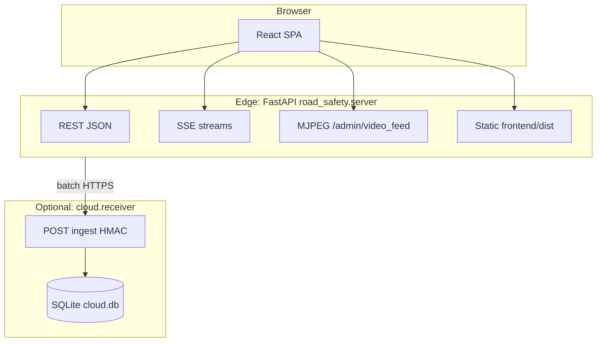
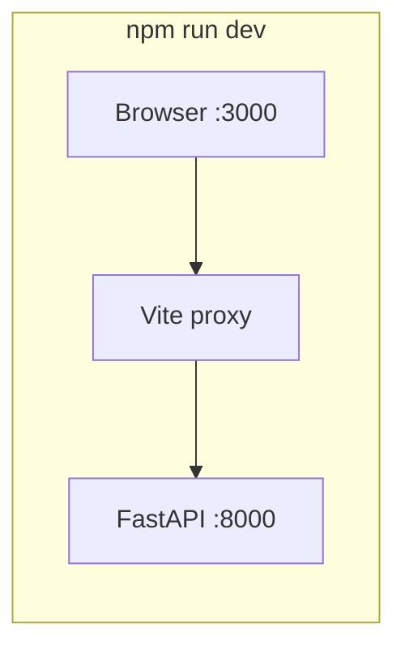
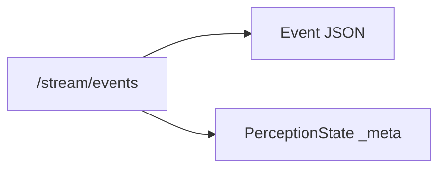
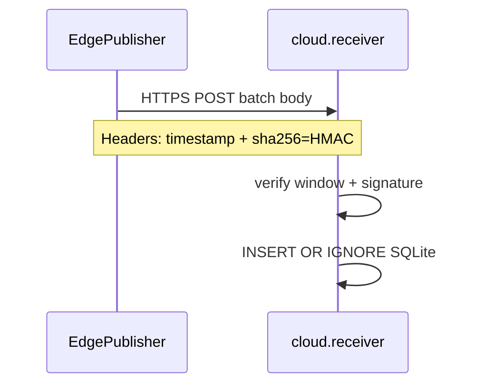

# Integration infrastructure

This document ties **frontend**, **edge backend**, and **optional cloud** together: URLs, auth tiers, request/response patterns, and deployment topologies. Use it as the “glue” layer when you already understand each side separately.

---

## 1. Integration overview

- **Browser ↔ Edge:** same origin in production (static files + API on one host:port). In dev, Vite proxies to the edge (see below).
- **Edge ↔ Cloud:** asynchronous, **batched**, **HMAC-signed** HTTPS; not used by the React app directly.

---

## 2. Development vs production wiring

### Production (recommended mental model)

1. Run `npm run build` → assets in `frontend/dist/`.
2. Run uvicorn on `road_safety.server:app`.
3. Browser loads `https://host:8000/` → JS/CSS from `/assets/...`, API from same host.

**No CORS configuration is required** for the stock UI because everything shares one origin.

### Development (two servers)

| Server | Port (default) | Role |
|--------|----------------|------|
| Vite | 3000 | Serves React with HMR; **proxies** API paths to Python. |
| Uvicorn | 8000 | Real FastAPI app. |

`frontend/vite.config.ts` proxies:

- `/api`, `/stream`, `/chat`, `/thumbnails`, `/admin/video_feed`, `/admin/detections` → `http://localhost:8000`

So frontend code keeps **relative paths** (`/api/...`) in both dev and prod.

---

## 3. FE → BE endpoint map (what calls what)

### REST (`fetch` via `lib/api.ts` and similar)

| Frontend usage | Method | Backend endpoint | Notes |
|----------------|--------|------------------|--------|
| Live status | GET | `/api/live/status` | Stream health, FPS, perception summary. |
| Scene | GET | `/api/live/scene` | Scene label + adaptive thresholds. |
| Drift | GET | `/api/drift` | Precision / feedback window. |
| Admin health | GET | `/api/admin/health` | Richer than live status for admin strip. |
| History / filters | GET | `/api/live/events?...` | Query params: `risk_level`, `event_type`, `limit`. |
| Tests | GET | `/api/tests/status` | Background pytest job status. |
| Tests | POST | `/api/tests/run` | Trigger test run. |
| Feedback | POST | `/api/feedback` | Body: `{ event_id, verdict: "tp"|"fp" }`. |
| Copilot | POST | `/chat` | Body: `{ query }`. |
| Watchdog | GET | `/api/watchdog`, `/api/watchdog/recent?n=` | Incident queue. |
| Watchdog delete | DELETE/POST | `/api/watchdog/findings`, `/api/watchdog/findings/delete` | Clear or selective delete. |

### SSE (`EventSource`)

| Frontend hook | URL | Server handler |
|---------------|-----|----------------|
| `useEventStream` | `/stream/events` | `stream_events` — replay + live queue; keepalive comments. |
| `useDetections` | `/admin/detections` | `admin_detections_sse` — per-frame detection JSON. |

### Images / video (not JSON)

| UI | URL | Type |
|----|-----|------|
| Admin video strip | `/admin/video_feed` | MJPEG multipart (browser `` or similar). |
| Event thumbnails | `/thumbnails/{filename}` | JPEG; public variant typically `*_public.jpg` with optional token query params. |

---

## 4. SSE payload contract (frontend perspective)

**Main event stream (`/stream/events`):**

- Most messages are **safety event** objects (`SafetyEvent` in `frontend/src/types.ts`).
- Occasionally the server sends a **perception summary** message with `_meta: "perception_state"` — `useEventStream` routes that to separate React state instead of appending to the event list.

**Admin detection stream (`/admin/detections`):**

- JSON snapshots with counts and `objects` arrays — consumed by `useDetections` for the sidebar.

---

## 5. Authentication tiers (edge server)

The backend enforces **three conceptual tiers** (see `CLAUDE.md`):

| Tier | Mechanism | Typical use |
|------|-----------|-------------|
| **Public** | None | SSE, dashboard UI, many `/api/*` reads, `/chat` (still audit-logged). |
| **DSAR / sensitive imagery** | Header `X-DSAR-Token` must match `ROAD_DSAR_TOKEN` | Unredacted thumbnails when token is configured. |
| **Admin** | Header `Authorization: Bearer <ROAD_ADMIN_TOKEN>` | LLM stats, audit log, retention sweep, road registry, agents, active-learning export. |

**Frontend note:** the shipped React app **does not** attach `Authorization` headers in `api.ts`. Admin routes are meant for **operators**, **curl**, or a future secured admin client — not for the default public UI.

**Thumbnail URL signing:** when `ROAD_PUBLIC_THUMBS_REQUIRE_TOKEN` is enabled, public thumbnails may require `exp` + `token` query parameters (HMAC-derived on the server). The event payload may carry presigned URLs from integrations like cloud export (`edge_publisher.build_thumbnail_url`).

---

## 6. Edge → Cloud integration (not browser)

This is **server-to-server**. The React app never posts to the cloud receiver.

| Component | Location | Role |
|-----------|----------|------|
| `EdgePublisher` | `road_safety/integrations/edge_publisher.py` | Append-only local queue; periodic batch POST with HMAC; exponential backoff. |
| `cloud.receiver` | `cloud/receiver.py` | Verifies `X-Road-Timestamp` + signature; dedupes by `event_id`; stores JSON in SQLite. |

Environment variables (typical):

- `ROAD_CLOUD_ENDPOINT` — HTTPS URL of the ingest endpoint.
- `ROAD_CLOUD_HMAC_SECRET` — shared secret (required on receiver startup).
- `ROAD_EDGE_PUBLIC_URL` — optional base URL for thumbnail links in payloads.

**Deeper diagram and bandwidth rationale:** `docs/architecture.md`.

---

## 7. Docker Compose integration

`docker-compose.yml`:

- **`app`** — builds image, exposes `${ROAD_PORT:-8000}:8000`, mounts `app-data` volume for `/app/data`, healthcheck hits `/api/admin/health`.
- **`cloud-receiver`** — **profile `cloud`**, port `${ROAD_CLOUD_PORT:-8001}:8001`, separate volume `cloud-data`.

So integration with Docker is: **one container for the full edge stack**; optionally **second container** for cloud ingest.

---

## 8. Identity fields on events (fleet integration)

Every emitted event should carry **`vehicle_id`**, **`road_id`**, **`driver_id`** (from `ROAD_VEHICLE_ID`, `ROAD_ID`, `ROAD_DRIVER_ID`). If unset, the server substitutes hostname-based placeholders — fine for demos, wrong for real fleet analytics.

Downstream **`road_registry`** (`services/registry.py`) aggregates by these IDs; the `/api/road/*` admin routes expose summaries.

---

## 9. Failure and reconnect behavior (UI ↔ API)

- **SSE (`useSSE`):** on error, connection closes and reconnects with **backoff** (caps at 30s). `connected` flag toggles for UI badges.
- **REST:** single `fetch` — callers catch errors (e.g. `useChat` shows error text in the thread).
- **Edge publisher:** network failures backoff at the **publisher** layer; UI is unaffected.

---

## 10. Document index

| Doc | Focus |
|-----|--------|
| [frontend-infrastructure.md](./frontend-infrastructure.md) | React, Vite, hooks, routes, SSE vs REST. |
| [backend-infrastructure.md](./backend-infrastructure.md) | FastAPI, packages, lifespan, pipeline, disk. |
| [architecture.md](./architecture.md) | Edge/cloud split, bandwidth, HMAC rationale. |
| [CLAUDE.md](../CLAUDE.md) | Commands, invariants, conventions for contributors. |

---

*This file is descriptive of the current codebase; when you add endpoints, update the tables above to keep integration knowledge accurate.*
